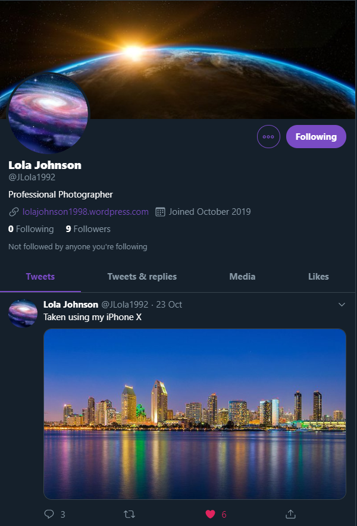

# HackBack2 — great fun, VERY challenging (Also OSINT)

(originally published Oct 27 2019)

This past weekend me and a few friends of mine competed in a UK-wide university CTF challenge called [HackBack2](https://tryhackme.com/room/hackback2), it was challenging beyond belief to even some fairly seasoned people, and as I’m only a first year Ethical Hacking student (as of the time of writing) I wasn't exactly blowing anyone away with my 1337-h4x0r skillz.

BUT (and there is a fairly big but) I do have something I think I can be proud of.

The way the challenge worked was that it was split up into 15 tasks, separated by difficulty and area of expertise. If you were the first to get the answer to any question you would be given 300 points, second 200, third 150, and after that 125 (with a random number of points from 0–20 being added on each time). TO MY KNOWLEDGE (and please DM me on twitter if I’m wrong and I’ll edit this article accordingly, [@IBRice101](https://twitter.com/IBRice101), same silly image) I was the very first person, or at least one of the first, to solve the OSINT challenge.

(If this sounds like bragging it’s not meant to be, I was shocking at literally everything else so this is kind of just me doing mental damage control, please let me have this.)

Well anyway, I thought I might as well do a bit of a write-up for this part of the challenge , so if that’s the only reason you’re here, I’m sorry for giving you my life story but god-damn it I just had to tell someone and you, the faceless, nameless void that is the Internet, seemed like just the right person to go to.

Anyway, let’s just start.

## [OSINT] Sometimes a little is a lot]

*johnson.lola1992@gmail.com*

That was the only piece of information we were given, from this we had to discern the following:

1. Where had Lola gone on holiday
2. What was her year of birth?
3. What’s her occupation?
4. What phone does she have?
5. How long ago did she start her current job?
6. What is the date of the capture?
7. What famous woman does Lola have on her web page?

The first part, it must be said, was the most difficult by far, Well, in some ways, I suppose.

The question regarding birth year was by far the easiest, (**Question 2: 1992**), god’s sake it was in her email, doesn't exactly take a genius to figure that one out.

After that, though things were a bit tougher. Because I tend to overthink things I jumped STRAIGHT at the [OSINT Framework](https://osintframework.com/) to solve my problems here, and whilst it probably could have done it was less than necessary. I made the mistake of running her email past every bloody email validation service I could find, in my defence it was quite early in the morning for me so I didn't realise at this point that all that would do is tell me that the email is real, and I kind of already knew that.

After about half an hour of this I did what I should have done in the first place, ran her details through the two main social medias I could access in the browser that I feel like most people have, Facebook and Twitter. Facebook didn't return much but Twitter returned a few, including one that immediately caught my eye. A picture of a galaxy as the profile image and… BINGO, the handle was @JLola1992, same initials, same order, same birth year, and when I found her profile the only person following er was an account that said it belonged to one of the founders of TryHackMe… That’s her alright.

Just from here we can already answer three questions, she’s a Professional **Photographer (Question 3)**, she has an **iPhone X (Question 4)**, and the capture was taken on **Oct 23rd (Question 6)**. Anything beyond this was going to be a touch more difficult, but not especially.

Question 1 still hadn't been answered yet, “best get on that”, I muttered to myself. I used my good old friend TinEye reverse image search and plugged the image (which is her only tweet, by the way) into the search box. Turns out that beautiful skyline is **San Diego**, the answer to Question 1.

What else do we have now? Questions 5 and 7. I couldn't see a way to get to 5 yet but why not give 7 a stab? I clicked on the link in her profile, lolajohnson1998.wordpress.com and saw the woman, that was **Ada Lovelace (Question 7)**, the world’s first programmer, the format matched, bang, one to go.

To my shame, this is the only bit I didn't legitimately complete, I looked at the format which TryHackMe had given us, which was “\* \*\*\*\*\* \*\*\*” and saw that the last two words were probably “years ago”, and after about 20 minutes of frustration I brute forced it, it was **5 years ago (Question 5)**… Sorry Mum.

OSINT has always been something I considered myself quite good at, even if I didn’t exactly know the word for it in the past, Thanks to TryHackMe for giving me the opportunity to do it and not get called a “stalker” or “a weirdo” or “he displays a serious disregard for personal space”

All jokes aside it’s an excellent challenge and I look forward to using their website for a while now to come.

Once again, if you’d like to take part in this challenge it can be found here, with OSINT and many, MANY more tasks besides. It’s brilliant.
