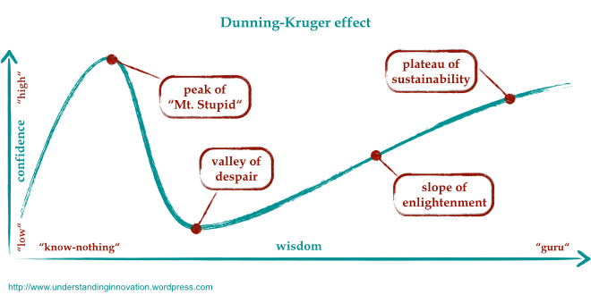

# Linux From Scratch project

I like Linux. To anyone who knows me this isn't really a secret. I evangelise about the benefits of each aspect of my setup at any given opportunity (to the point that my flatmates are probably getting quite annoyed lol).

The problem now, though, is that I have come to realise that I don't ACTUALLY know that much about Linux, I'm in the phase of my knowledge about Linux that Dunning and Krueger would call "The valley of despair" (although to be totally honest I'm not, like, depressed about the fact I don't know all of the Linux kernel modules and their functions and stuff lol).

This project is going to rectify this, though.

In this project I am going to build a Linux From Scratch system, a project based on [Gerard Beekmans' book of the same name](../media/LFS/LFS-BOOK.pdf), in which I will go from absolutely, totally nothing, to a working Linux distribution! Well... If you could call it that lol

This page is going to serve as the "home directory", if you will, of my Linux From Scratch work, I will be periodically updating this page with walkthrough articles galore in an effort to document my full journey from Linux noobery to "guy who knows some stuff, I guess", how exciting!

