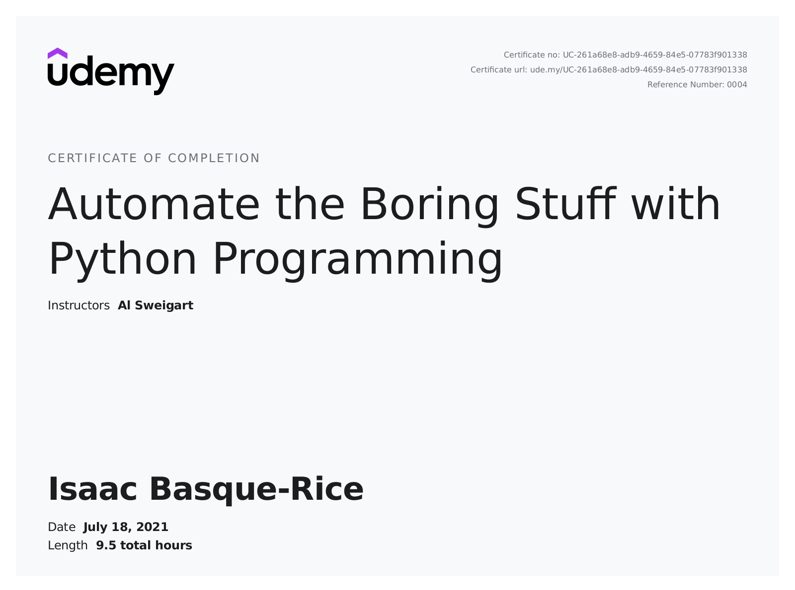

# Automate the Boring Stuff with Python

On July 1st, 2021 the Udemy course for [Automate the Boring Stuff with Python](https://automatetheboringstuff.com/) became free with a coupon, so I decided to have a little crack at it

A lot of the earlier stuff is (as you can imagine) sorta dull for someone who's been programming for... However long I've been doing it now, but still it seems like a pretty invaluable resource as the course goes on, especially for someone who hates boring stuff lol.

In many ways, this was really more a vim tutorial, although Al may not have intended it that way. During the course of my working on this project I decided, for the first time, to do it exclusively in vim, throw myself in at the deep end I guess. And you know what? It's actually really helping me learn! Vim is a really fantastic editor, check out my article on it [here](https://IBRice101.github.io/HacksocWIki/vim)!

A note: some folders have significantly less content than others, this because a lot of work done in the course is done exclusively in the console and is therefore not save-able in this context

I completed the course on the 18th of July 2021 at around 6PM :)

The Git repo with all products of my work is available at https://github.com/IBRice101/automate-the-boring-stuff

Thanks to Al Sweigart, the author.
