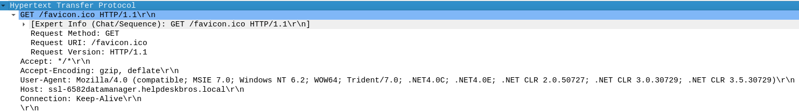
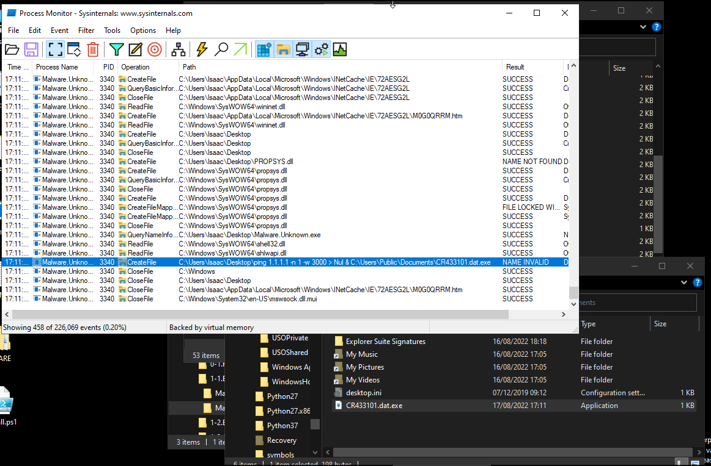
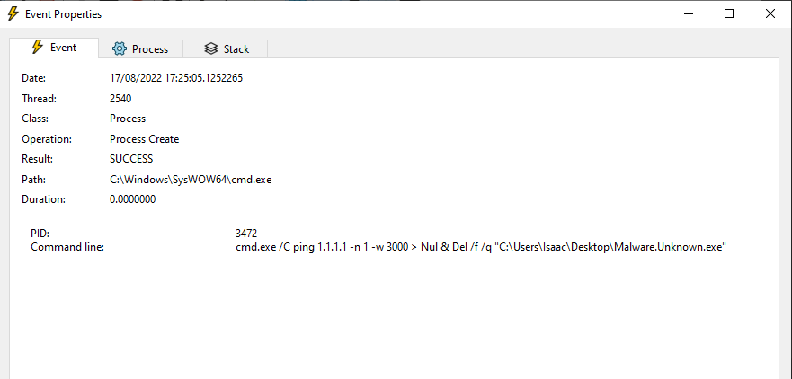
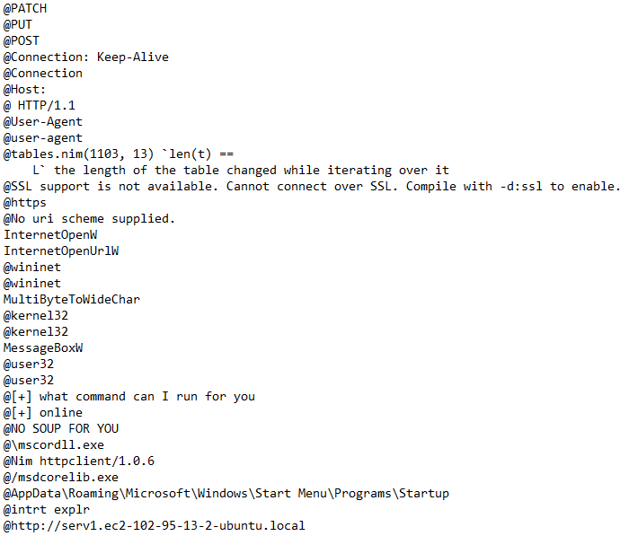
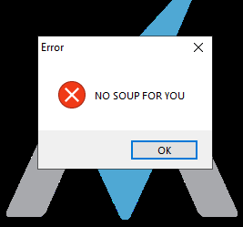
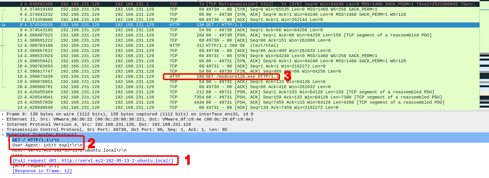
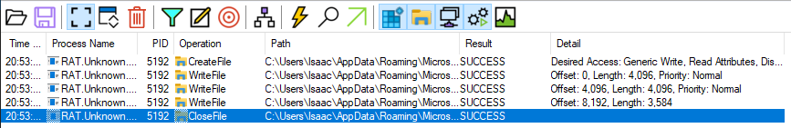
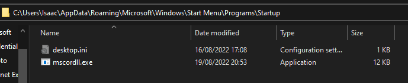
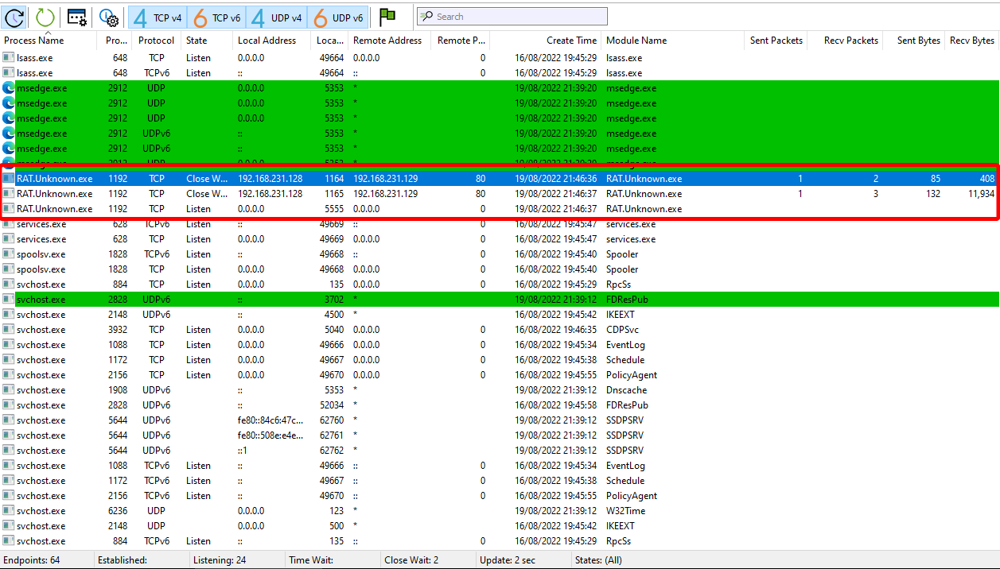
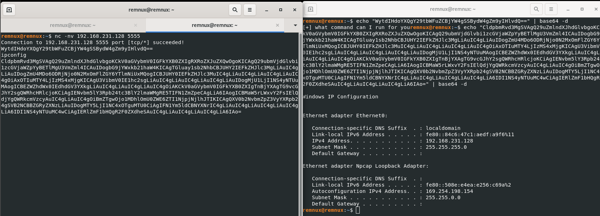

# Basic Dynamic Analysis

# Intro: Host and Network Indicators

- Dynamic Analysis is also known as Heuristic or Behavioural analysis
- The process of running software (malware specifically) to see what it really does
- Taking a triage approach at this stage, basic stuff
  - Limited tools
  - Limited time
  - Will be running malware in malware
- Tell us a lot about
  - Host Indicators
    - Deletes File
    - Installs Persistence
  - Network Indicators
    - Calls out to a domain
    - Downloads a file
  - Two sides of the same coin
    - DNS Request, for example
      - Sometimes it can be a host indicator if it's being pulled from a host log
      - Sometimes it can be a network indicator if its being pulled from network logs or if it's identifiable on the network wire
  - Doesn't matter too much, so long as you do both

## Initial Detonation & Triage: Hunting for Network Indicators

- Must have all tools up and running
  - Includes INetSim
  - This malware (`Malware.Unknown.exe`) deletes itself from disk if a non-internet connected sandbox is detected
  - Also run Wireshark for packet capturing
- In wireshark use query `http.request.full_uri contains favicon.ico`
- Then detonate malware
- Wireshark should have a packet request
  - Under Hypertext Transfer Protocol header there was a GET request for favicon.ico
  - Using Mozilla 4 as a user agent
  - Full URI is also present
  - See below for network signatures



## Host-Based Indicators: Procmon

### Part 1

- Had to install procmon externally (note: it is not in the PATH so it must be located and ran manually)
- procmon gives information about processes and what they are doing at any given point
- It can be a lot of information, this is where the filter tool comes in
  - Filter for `Process Name` + `is` + `[NAME OF MALWARE]`
  - and then Add + Apply + Ok
  - No events will show, because malware has not been detonated yet
  - **DO NOT FORGET TO HAVE INETSIM RUNNING**
    - Note: Do not run INetSim using sudo, it defaults to multicast (0.0.0.0)
    - Also note: You may need to disable automatic proxy to get it to work, idk why
- Detonate the malware
  - Information available:
    - Time (known)
    - Process Name (known)
    - PID (interesting but not that relevant)
    - Operation (very important, informs us what the malware is doing)
    - Path (where in the OS is this interaction taking place)
  - We can filter fields too, for example, filtering the operation column
    - Filter for `Operation` + `contains` + `File`
    - then add + apply + ok
    - Now we can see the malware creates files, reads files, queries file names, information, and so on and so forth
    - We can then expand the Path field to see what files specifically the malware is targeting
  - Scrolling down we can see that one of the files that is created correlates with a string found within the malware
    - `C:\Users\Public\Documents\CR433101.dat.exe`
    - We could apply that as a filter, also
    - Go to file explorer and find that file
    - Delete new file and rerun malware to make sure
- What we know now:
  - Reaches out to a particular URI (a favicon.ico, which is served automatically whenever a website loads)
    - Do not have enough information to correlate this and the following
  - Creates a file
    - From this we can hypothesise it's a malware dropped
    - Downloads malware from somewhere else and drops it into a system



### Part 2

- Looking at how it deletes itself from disk if no internet connection is detected
- In the strings we find a command that, in part, issues `Del` (delete)
- Detonate Malware (with INetSim not running)
  - That delete command is issued where it was not before
  - Command deletes itself from disk when ping command issued to 1.1.1.1 and does not receive a reply



- Program Execution Flow:
  - If URL Exists:
    - Download `favicon.ico`
    - Writes to disk named `CR432101.dat.exe`
    - Run `favicon.ico` (now called `CR432101.dat.exe`)
  - If URL doesn't exist
    - Delete from disk
    - Do not run
- Process is now ~~`Malware.Unknown.exe`~~ `Dropper.DownloadFromURL.exe`

## Dynamic Analysis of Unknown Binaries

### Part 1: Analysing Wireshark

- Analysis of a new binary
- `Rat.Unknown.exe` 
- Contents of the README.txt:

```
Analyst,

Excellent work with the last sample. Please take a look at the one in this directory. Our IR team said it might have command execution capabilities, but we're not sure.

Please proceed directly with Basic Dynamic Analysis and determine:
- Network signatures
- Hist-based signatures
- Command execution capabilities, if any
- Any other findings

RE Team
```

- Strings first
  - Useful to write output to a file to search through later
  - `floss.exe RAT.unknown.exe.malz > floss.txt`
  - Strings with references to Windows API calls, specifically internet connection ones
    - This also includes a User Agent, too. Food for thought.
  - Strings like "NO SOUP FOR YOU" (Seinfeld reference) as well as "what command can I run for you?" and "online" hint this may be a CLI interface of some kind
  - Extensions seen throughout the strings imply this is a binary originally written in nim
  - See interesting strings below:



- Initial Detonation: Message Box pops up, "NO SOUP FOR YOU" within, see image below



- Ensure INetSim and wireshark are both running now, to capture packets and such
- Second detonation: behaviour changes with introduction of internet capability 
  - No popup
  - Plenty of TCP and HTTP packets being sent over the network
  - TCP handshake just sets up stuff, I jump straight to HTTP
  - Get request out to URI (image below, 1)
  - User agent is `intrt explr`, this is not a valid user agent (image below, 2)
  - GET request retrieves a suspicious executable (`msdcorelib.exe`), may be a second stage payload (image below, 3)
- We now have information regarding what many of the strings seen above are actually doing in the malware



- Following the HTTP Stream in Wireshark
  - Right click any packet seen herein and go to `follow > HTTP Stream`
  - See a transaction, in particular grabbing this specific file from the system located at the URI the malware is pointing to
  - Of course because this is using INetSim it doesn't work, but the malware *thinks* it has
  - Note: There is no guarantee the name of the file in the GET request is the actual name of the file it's grabbing 
    - Download and writing to disk can be two separate transactions
    - Data of the download can be transmitted first and then written to the filesystem another time
- In conclusion:
  - Malware functions only when online
  - Potential file download: `msdcorelib.exe`
  - from `serv1.ec2-102-95-13-2-ubuntu.local`

### Part 2: Host-Based Indicators

- Revert back to a clean state, as the binary has been detonated
- What do we know?
  - Made HTTP Request to specified server 
  - Downloaded something served up by INetSim
    - Could be 2nd stage payload
- Looking back at strings
  - Contains file path to Startup directory
  - Commonly used for programs that start on boot
  - Very common malware vector
- Let's use procmon again
  - Filter using the name of the process (as seen previously)
    - Detonate
    - Lots of information shown
  - Filter using `Operation contains File`
    - Querying information out of lots of different DLLs 
  - Filter using `Path contains AppData\Roaming\Microsoft\Windows\Start Menu\Programs\Startup`
    - Does not need to know the user's name, dynamically discovers absolute file path depending on the user that deployed the malware
    - Creates file `mscordll.exe` in this location
      - Note that this is *not* the file retrieved using the GET request, or at least it does not have that name
      - Could be moved and renamed here once downloaded
    - Writes to the file three times
    - Closes file




- Reverted snapshot and re-armed binary
- How does a host know how to connect to another host?
  - Needs to understand the concept of a TCP connection
  - Classes of functions the host needs to understand to form that connection
  - We can pick up on some of these indicators as TCP artefacts
    - Socket opening
    - Connection going out
  - This comes from the host itself
  - Part of the host but has to do with network signatures
  - Kinda like yin and yang lol
  - How do we do this? Wireshark can't track that
- TCP View!
  - Note: this, like Procmon, is part of the SysInternals suite, turns out that doesn't install very well with Flare, so lol I guess
  - TCP view shows the following
    - Process Name
    - PID
    - Protocol
    - State
    - Local Address and Port
    - Remote address and port
    - Create Time
    - Module Name
    - Sent Packets/Bytes
    - Receive Packets/Bytes
  - Sort by process name in alphabetical order
  - Detonate malware
  - Spawns three connections, can be seen in the image below
    - In a listening state on all addresses (0.0.0.0 is all addresses/multicast)
    - At local port 5555



- On the Remnux end we can use netcat to connect to the target as it's broadcasting
- Use command `nc -nv 192.168.231.128 5555`
  - `nc`: netcat, the TCP/UDP swiss army knife 
  - `-n`: Do DNS lookups
  - `-v`: verbose output
  - `192.168.231.128`: the Flare-VM/Windows machine
  - `5555`: the port
- This returns a Base-64 Encoded string, encoded and decoded as follows:
  - Encoded: `WytdIHdoYXQgY29tbWFuZCBjYW4gSSBydW4gZm9yIHlvdQ==`
  - Decoded: `[+] what command can I run for you`
- Can be assumed that this is therefore a Remote Access Terminal with command injection capabilities encoded in Base64
- command `ipconfig` issued in netcat, output is as follows:



- We now have lots of info to go off of
- Process is now ~~`RAT.Unknown.exe.malz`~~ `RAT.CmdSocket.exe.malz
- To cross-correlate using procmon
  - Filter for `Operation contains TCP`
  - Issue a command on Remnux to the reverse shell
  - See what happens in procmon (successful TCP receive and send)
  - Can use procmon in lieu of TCP View

## Analysing a Reverse Shell

### Part 1: Correlating IOCs


### Part 2: Parent-Child Process Analysis

