# Minesweeper Reverse Engineering Workshop

This is a guided workshop session based on [this](https://www.begin.re/hacking-minesweeper) challenge. This page specifically is supposed to serve as a walkthrough for beginners to RE.

If any of this doesn't make sense of you need any help whatsoever, I'll be around to help, either in real life if we're in hacksoc, or on discord as `EyeSack#5624`

## Why?

Reverse Engineering is one of the hardest and (in my opinion) most rewarding things in security, figuring out how something works just so you can break it is at the very core of the hacker mindset, and whilst this workshop isn't *directly* dealing with security stuff (no malware unfortunately, fuck the risk assessments and I don't want to confuse anyone) it serves as an introduction, and hopefully I can share my enthusiasm for the topic with everyone here.

Another reason I'm doing this, really, is to show you my favourite methodology for learning a new tool. Using new and complex tools (like Ghidra, Metasploit, Nmap, any programming language, hell, even Linux itself) can be quite daunting, but this methodology (with some help from [Game Maker's Toolkit](https://youtu.be/vFjXKOXdgGo)) has been really beneficial for me

1. Learn or be taught the very basics of the tool <- **YOU ARE HERE**
2. Familiarise yourself with the basics through repetition
3. Slowly build on your knowledge by getting more and more bold with what you want to do

This incremental model of learning is absolutely brilliant and has helped me learn all kinds of tools, including this one, even without knowing it. It allows you to be able to get started on anything with at least some degree of confidence (the first and often hardest step for any procrastinating brain) ad absolutely crucially, it also gives you a repertoire of words you can use to google anything you need should a problem arise. Google is the most powerful tool in your arsenal by a long shot, use it (or any other search engine, ofc).

## What?

Today we'll be reverse engineering Minesweeper. I *adore* Minesweeper, I've lost hours of my life to this little game (especially when I should be doing other things) And I'm sure a few of you have too.

If you're unfamiliar with the game, lets go over a few of the basics.

Minesweeper is a point and click game developed by Microsoft for Windows 98 to get people used to using the mouse (that's how old this is lmao). Clicking on the field will reveal some numbers, these numbers represent how many mines that number is touching, so for example a number 2 is touching 2 mines, 1 is touching 1 mine, and so on. The object of the game is to place flags on mines by right clicking the space where you expect them to be, you win when you have flagged every mine on the board. 

Let's say, though, that you're lazy and can't be bothered actually playing the game, you just want to win immediately and have every mine flagged automatically. That can't be done without some scripting stuff, or some AI programming video you watch at 1AM instead of doing your miniproject, right?

WRONG! Using some Reverse Engineering wizardry you can do just this in no time at all.

We'll be using an old version of Minesweeper today, available [here](winmine.exe). If you're like me, this will give you an overwhelming wave of nostalgia for a simpler, Windows XP based time.

## How?

We'll be using Ghidra for this. Ghidra is a reverse engineering tool developed by the NSA and released under... dubious circumstances back in 2018. This tool is super powerful, it has a debugger for dynamic analysis, a decompiler that displays code retrieved from the binary in a more readable (C-like) format, and automatic PE Header analysis... Not that I expect many of you to know what that is. If I'm being honest, this workshop is mostly to show off Ghidra and make you aware of how to use it, because I love it (and Radare2 but that's for another day).

## The Challenge

### Approaches You Can Take

You have two methods of tackling this, really, either as a programmer, or as a ***GAMER***, both are equally valid options, of course, although we will only be going over one.

To understand the two options it is necessary to know that Minesweeper is both a GUI application and also a data structure, that being a 2D array of randomised values where 2, for example, is "is flagged" (this is after a user has interacted with it, of course), 1 is "has bomb", and 0 is "does not have bomb".

The ***GAMER*** option is to treat Minesweeper as a primarily GUI application and have the patched version draw a flag everywhere where there is a mine, changing the printing function. In Oversimplified C++™ this would look like this:

```c++
bool board[81];  // the game board can be of varying length but the "beginner" mode is 9x9

if (board[i] == true){ // meaning if it has a mine on it
    plant_flag(); // calling a function already inside the codebase
} else {
    print_empty();
}
```

The programmer (cool) way is to treat it solely as an array (just that we don't know the values of yet). This way we can just follow the same steps the program takes to determine the location of the mines currently and replace them with a flag.

```c++
int i;
int board[81]; // the game board can be of varying length but the "beginner" mode is 9x9

for (i = 0; i < sizeof(board); i++) {
    if (board[i] == 0) { // if empty
        continue; // do nothing
    } else if (board[i] == 1) { // if mine
        board[i] = 2; // plant flag
    } else if (board[i] == 2) { // if flagged
        continue; // do nothing
    } else {
        // throw error
    }
}
```

This was chosen because it can be represented entirely in code, and also, tbh, its a little more of a challenge so I though it'd be fun, feel free to do it either way yourself, though.

### Setup

On the computer in front of you should have a copy of *Ghidra*, this is the primary reverse engineering tool we will be using for this walkthrough. Ghidra is started by locating and running the `ghidraRun` binary. Once Ghidra is opened, you can either press `Ctrl+N` or go to `File > New Project` to open up a new project. 

At this stage you should be greeted with the New Project wizard. The first option you will have is to create either a "shared" or "non-shared" project. You want "non-shared" at the minute (and most of the time, actually).

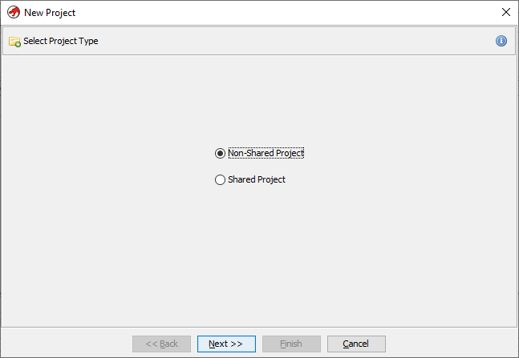

Next specify where you want to save the project files. I recommend creating a new subdirectory wherever your Minesweeper application is called `Ghidra` and saving it in there, as you can see in the image below.

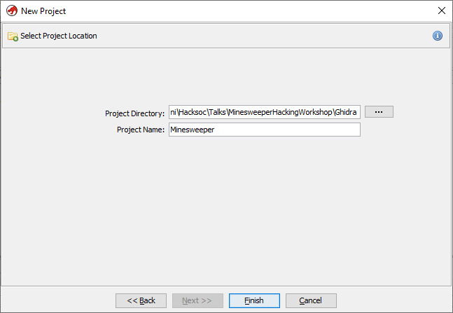

Once this is done its time to import the actual binary/exe file into the project. This can be done either by pressing `I` on the keyboard or going to `File > Import File...`, and then locating the Minesweeper executable wherever you have it placed. Doing this will result in a popup telling you this file is a Portable Executable (PE) File, which is the file format in windows for all binaries, Libraries, System Files, and so on. It will also give you information about the "Language", meaning the assembly language type, x86 in this case, the destination folder, and the name of the program

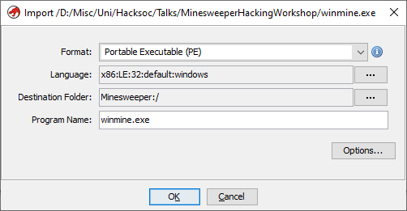

Once the ok option is selected, you'll be shown a fairly large amount of information about the file, this is known as the PE File Header and contains all the metadata for the program, including the language and compiler ID, modification and creation time, copyright info, and other such info.

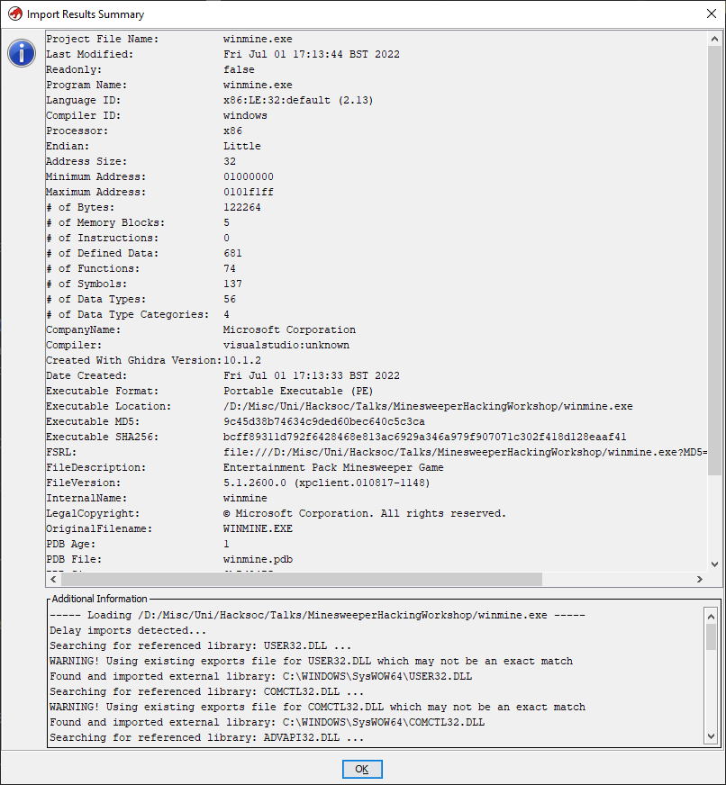

As soon as this is dismissed you'll be nearly ready to analyse. To get into the actual code viewer you need to press the little dragon icon under the "Tool Chest" heading, shown highlighted below.

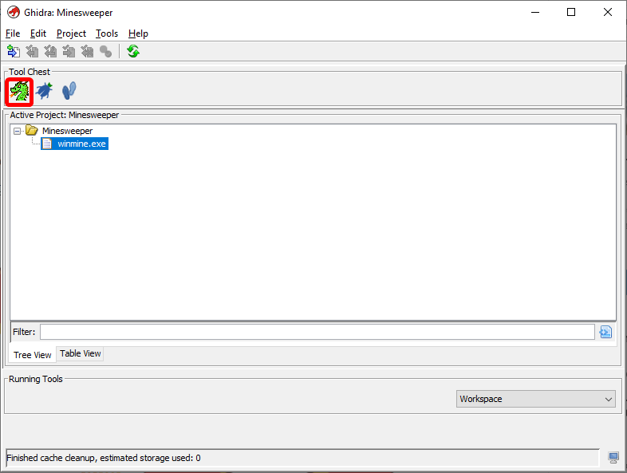

This will take you to an empty code browser view. Use `Ctrl+O` or `File > Open...` to open winmine.exe in the code browser itself. Following this you will be prompted to analyse the executable. Click Yes followed immediately by "Analyze". THere are unticked options available to you but they are in beta and/or will likely not be helpful to you. If you like you can read through each of these and try to work out what each of them do, or don't, I'm not your mum.

### Getting To The Minefield

Now we're into the meat of the reversing process. Unfortunately, this executable has no "debug symbols", what you'll probably know as identifiers, or variable and function names. This isn't necessarily ideal from a reversing perspective, but from a learning perspective is pretty good, as it prompts you to really learn what each of the functions and variables actually do and how they actually work, as opposed to simply going off the identifier. I also get to teach you how to rename files!

So... Remember how I said earlier that Minesweeper is "a 2D array of randomised values"? This is where that really comes into effect. **We need to find where the minefield is in code**. The first step to solving this challenge is to realise that the developers had to randomise this somehow, and the most likely way of doing that is by using `rand()`, a function inside the `MSVCRT.DLL` file, that has likely been imported. In the Symbol Tree, on the right of the screen, you will see a collection of directories that the program has kindly generated for us. To find `rand` go to `Imports > MSVCRT.DLL > rand`, as illustrated below

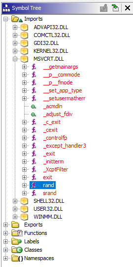

Clicking on this directs us, inside the `Listing` window, to a location in the assembly code which is a pointer to an External (`rand`) function. this pointer has a single XREF (pronounced cross reference) to function `FUN_01003940`

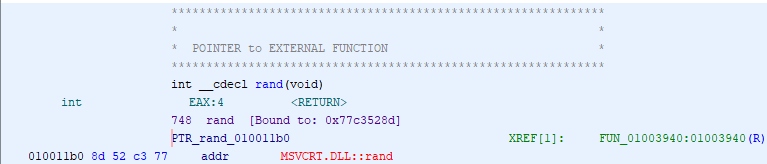

Going to that function shows the following code in the Decompiler window:

```c++
int FUN_01003940(int param_1)

{
    int iVar1;

    iVar1 = rand();
    return iVar1 % param_1;
}
```

We will be calling this function `rand_caller`, rename a function in Ghidra by right clicking it and clicking `Rename Function`, or by simply pressing `L` on the keyboard.

### rand_caller

So what does `rand_caller` actually do?

Well, often instead of relying purely on the decompiler as our only source of information, it's better to try to read some assembly! Don't worry, it's not as daunting as it seems.

Something you will need to know here is what a register is. A register is a small memory location on the CPU that allows it to access data much quicker than pulling from RAM. There are four 32 bit registers, `EAX`, `EBX`, `ECX`, and `EDX`, which can be subdivided into the 16 bit data registers `AX`, `BX`, `CX`, and `DX`, and further subdivided into 8 bit data registers `AH`, `AL`, `BH`, `BL`, `CH`, `CL`, `DH`, and `DL`.

The full disassembly of the `rand_caller` function can be seen below.

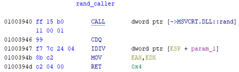

And here is a step by step guide to what all this means:

1. `CALL dword ptr [->MSVCRT.DLL::rand]` - Call the random function from its Dynamic Link Library, stores the result in the `EAX` register
2. `CDQ` - Convert doubleword (dword, 4 bytes) to quadword (qword, 8 bytes), AKA convert an int to a double. This command expands the value in the `EAX` register such that the value is now stored in the `EDX:EAX` register pair for the next instruction.
3. `IDIV dword ptr [ESP + param_1]` - `IDIV` divides the contents of the `EAX:EDX` pair by the operand value, which is the address of the stack pointer (`ESP`) + the "offset" (memory location) of `param_1`, after which it stores the quotient in `EAX`, and the remainder into `EDX`. This is essentially synonymous with a modulo operation, to get the remainder of a number divided by another number
4. `MOV EAX,EDX` - Move the contents of EDX into EAX, in Intel syntax (one of two kinds of syntax for assembly language), when performing a move operation, the second operand always moves to the first. Additionally, "the fact that EDX is moved to EAX right before the function returns implies that the relevant value is the division remainder".
5. `RET 4` - Return 4, although this is essentially irrelevant.

So we now know that `rand_caller` calls `rand` and then ensures that the result does not exceed `param_1`, we know this because the remainder of any modulo operation is always less than the number the original value is being divided by. If this doesn't make instinctive sense to you, I encourage you to use an [online C compiler such as this](https://www.onlinegdb.com/online_c_compiler) to recreate the code and plug values in.

Knowing that, now we can move on to the XREFs. This function is referenced twice in the same function, `FUN_0100367a`... This is interesting, no? Don't forget we're looking for the minefield generator here, and where else would the minefield be located but where `rand_caller` is referenced??

In the function itself we find `rand_caller` being referenced within a nested `do..while` loop, So we can begin our analysis there. 

NOTE: Making use of the decompiler window I have taken the liberty of renaming the variables to which `rand_caller()` is set `rand_1` and `rand_2`, this makes reading the assembly easier as the ghidra disassembler very cleverly is able to work out what's relevant where.

### The Loop

For this piece of reversing we'll be making use of Ghidra's excellent Function Graph utility (seen below). You can access this by going to the top nav bar and clicking the 7th button from the left (looks a bit like an upside down tree).

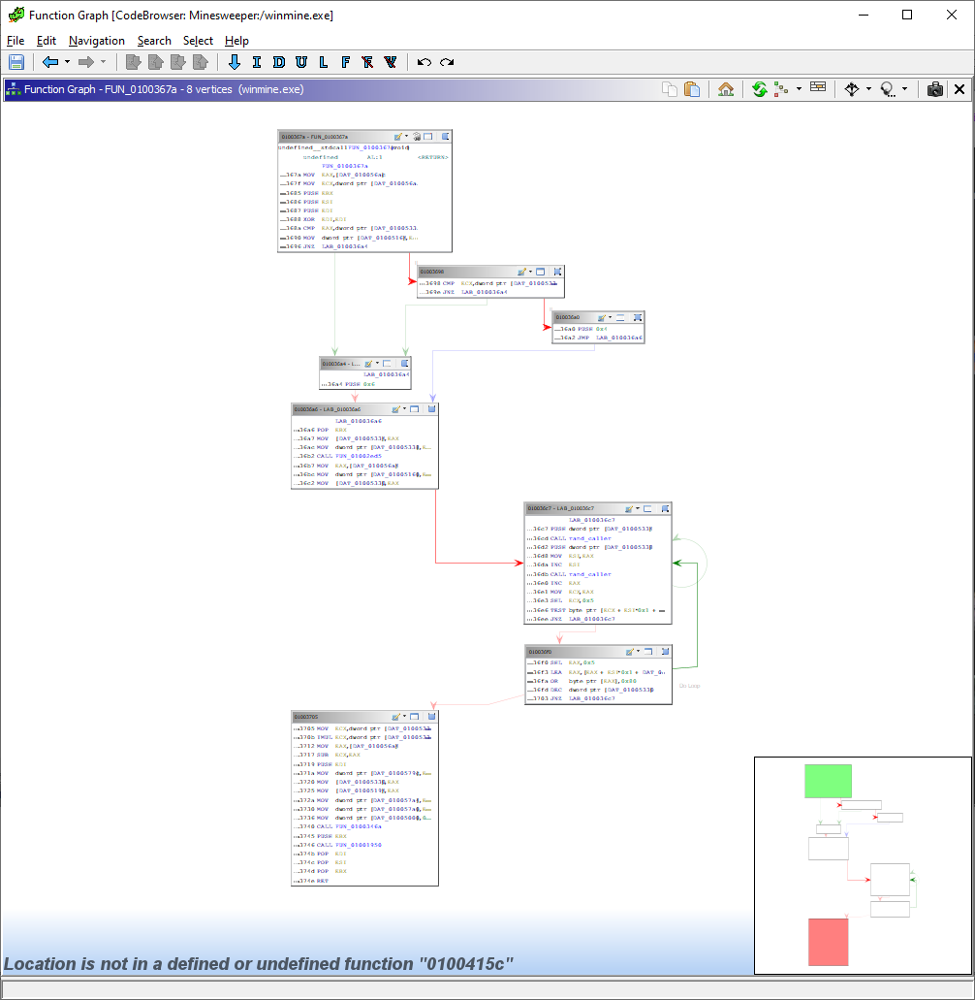

In particular we're focussing on the structures at offsets (locations) `010036c7` and `010036f0`, which are where the two loops we're interested in are.

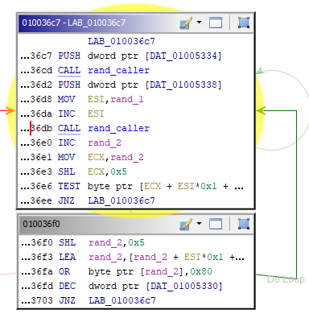

#### What Are We Looking At?

So what are we actually looking at here? Firstly we have `LAB_010036c7`, which is a label that allows us to jump back up to the top if a specified value is not zero (that's what `JNZ` does). After this we push a `DAT_` value onto the stack, this often means a global variable or something of that nature. We call rand_caller on this and that bit's done there.

Next we push a second value on the stack, but instead of immediately calling `rand_caller()` we move `rand_1` to the `ESI` register (which is traditionally used for memory array copying) and increment that by 1. 

After this `rand_caller` is once again called on `rand_2`, it also gets incremented, and moved to ECX. This time, however, it gets bit shifted left (`SHL` == Shift Left) 5 times, thereby multiplying the value by 32.

All in all `rand_1 == DAT_01005334 + 1 && rand_2 == (DAT_01005338 + 1) * 32`. If this doesn't make sense to you, call me over or message me on Discord and I'll explain :).

Following on, we have the command `TEST byte ptr [ECX + ESI*0x1 + DAT_01005340],0x80`. This sums `rand_1` and `rand_2` and places the result in some memory location, which is then tested against the value `0x80`.

"Why `0x80`?" You ask, smartly. Because this number is equivalent to `0b10000000` in binary, that is, an 8-bit binary number where the only bit that is set is the most significant bit. If you tak every number that has this bit set (essentially any number larger than `0x80`) and perform a logical AND operation on `0x80` and that value, the result will always be `0x80`. This can be seen in the truth table below.

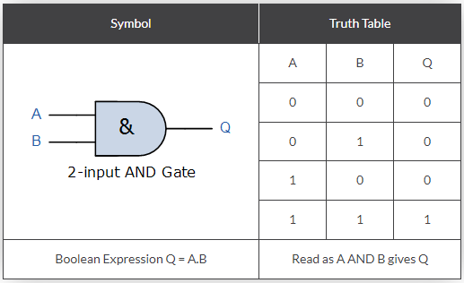

For example, say we have the number `0x9e`, that is `0b10011110`, this is the result:

| AND table | Hexadecimal | Binary     |
|-----------|-------------|------------|
| Operand 1 | 0x9e        | 0b10011110 |
| Operand 2 | 0x80        | 0b10000000 |
| Result    | 0x80        | 0b10000000 |

Because the only result of a logical and that returns 1 is `1 AND 1`, if there is a 0 it will always return 0. In this way, this is a check to see if a number is higher or lower than `0x80` (which is 128 in decimal), or in other words, to see if the 8th least significant bit is set or not. If the check returns true, we go back and run the same block again, if false, we move on to the next block

In the next block we do the following:

1. Multiply `rand_2` by 32 again (redundant, probably a compiler thing)
2. Load into `rand_2` the value stored in the same offset from the same memory location we referenced before
3. We then perform a logical OR operation on `rand_2` with the value `0x80`, which is the same as setting the 8th least significant bit to 1
4. Then decrease some loop variable by 1 and continue

#### What Is Actually Happening

So this loop does the following:

1. Randomises two values
2. Reference a single byte in memory sung the sum of these values as an index
   - Like fetching an element from an array using an index (i.e., `board[x]`)
3. If 8th LSB set 
   1. randomise an offset again
4. else
   1. set and continue with loop

This is almost definitely the logic for random positioning of mines where the 8th LSB is marking a mine, we pick a random location on the minefield and if that location has a mine we go somewhere else, if not, we set a mine ath that location. The number of times we do this is determined by a global variable called `_DAT_01005330`, which is a copy of `DAT_010056a4`, we can rename the function to `place_mines`.

### Dynamic Analysis

The `DAT` values we are interested in are unfortunately only assigned at runtime on account of the fact they are user-defined. To learn the contents of these values and gain a better understanding of the program as a whole we need to do what is called dynamic analysis, that is, run the program, attach it to a debugger, and see what is going on inside the program at runtime.

#### OllyDbg

To do this we first need a debugger. My preference at the moment is OllyDbg, just because I like the look and I've used it fairly recently. It can be downloaded [here](http://www.ollydbg.de/) and may also be available on the computers in front of you already.

As a reminder, we're looking for the contents of the variables `DAT_01005334` and `DAT_01005338`, which are the parameters passed to `rand_caller`, as well as the value of `DAT_01005340`, which is the base address to which the offsets (the indexes, or positions on the board) are added. To begin the process of performing dynamic analysis on winmine, do the following:

1. Open OllyDbg
2. Go to `File > Open` (or alternatively hit F3) and then navigate to winmine.exe
3. You will be greeted with something looking roughly like this, again don't worry, its actually fairly simple when you understand what each of the windows are

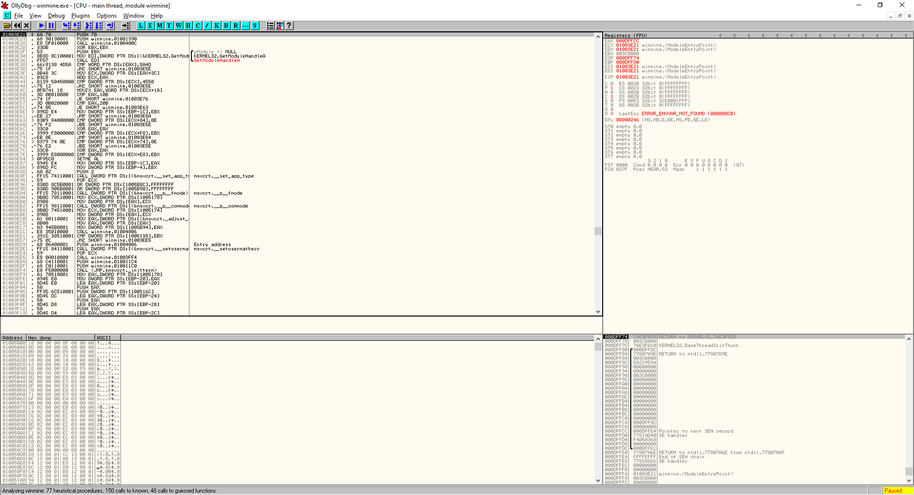

The OllyDbg window can be split into roughly four sections. 

- The top left is the *Disassembly Window*, this is *roughly* the same stuff we see in Ghidra, but presented in a less neat format, there are some helpful comments though. 
- The top right is the *Registers Window*. This window is really useful during debugging because it shows the contents of each of the registers in memory
- The bottom left is the *Memory Window*, this shows the hex dump of the entire program
- Finally the bottom right is the *Stack Window* this, helpfully, shows the contents of the stack, lol 

#### Working With What We Know

To continue the dynamic analysis:

1. Locate the beginning of the do loops mentioned earlier. If you'll recall, this has a label in Ghidra (`LAB_010036c7`), so locating it should be no issue (it's at offset `0x010036cf`)
2. Scroll up in OllyDbg to find this address, and press F2 to place a breakpoint.
3. Hit F9 to run winmine, or press the play button in the top right hand corner
4. When the breakpoint is hit (should be before the board even shows up) press F8 to step over the current instruction once, make a note of the uppermost value in the stack window (bottom right), I see a 9
5. This following instruction is a call, as we know from Ghidra it is a call to `rand_caller`
6. Hit F8 twice more to get past the second push instruction. What value is pushed onto the stack? I get a 9 once again. (Consider the significance of the number 9 in Minesweeper for a moment here)
7. Step through the program until you reach `0x010036e6`, where we check if the 8th LSB is set
8. When we get to this address we can see that the value to be checked, `0F`, is being displayed below the disassembly window (`DS:[01005462]=0F`), this means the test instruction, to test if the 8th LSB is set will return false, and if we're right that means we've just come across an empty cell (no mine)
9. Continue to hit F8 until you reach the OR instruction. once that is done go to the address `0x01005462` (or whatever one shows up for you) by right clicking and clicking "Follow address in Dump"
10. If what we figured out earlier is correct, the value at this address should change from `0x0F` to `0x8F`, the 8th LSB will be set by this instruction, due to the fact that bit was not already set.

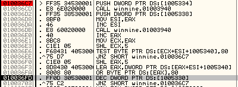

#### Understanding Data In Memory

Next, we should analyse the variable at `0x01005340`. If we navigate to this memory location in the memory window we see the following:

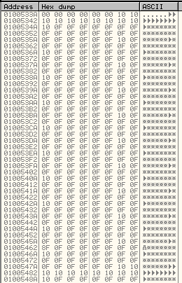

What actually is this?

- Visibly sequential series of values
- 11*`0x10` followed by 21*`0x0F`, adding to 32 bytes
- 9*repeating chunks of 32 bytes, consisting of
  - 1*`0x10`
  - 9*`0x0F`
  - 1*`0x10`
  - 21*`0x0F`

Due to the fact Minesweeper is, by default in this instance, a 9x9 game, it is likely that the 9*`0x0F`s are rows, with the `0x10`s being line beginnings and ends, or "delimiters". We can assume now, then, that `0x0F` represents and empty square, and `0x8F` represents a mine. 

#### Finding The Flag's Value

So we have empty squares, and we have mines, what about flags? Well, getting the value of a flag is trivial.

1. Clear all breakpoints by highlighting the previous breakpoint and hitting F2 again
2. Run the Minesweeper program, making sure to be looking at the board in the memory window
3. Right click a square on the board, ideally somewhere you can easily find such as the top right or bottom left
4. Click into the debugger and view the change

The flagged square has gone from `0x0F` to `0x0E`. Which means a flagged and empty square has to be represented by `0x0E`, and a flagged and mined square has to equal `0x8E`!!!

### Patching

Now it's time to modify the code, but first, of course, we need to figure out **HOW** we need to modify it

#### Some Arithmetic

Okay, so we need to turn all instances of `0x0F` to `0x8E` instead of `0x8F`... How can we do that?

The three numbers that concern us are the following in binary:

- `0b00001111` == `0x0F`
- `0b10001111` == `0x8F`
- `0b10001110` == `0x8E`

So the two differences between `0x0F` and `0x8E` are the first and eighth LSB, setting the 8th and un-setting the 1st will give us the desired result.

For this we can use an XOR. Specifically, `0x0F XOR 0x81 == 0b00001111 XOR 0b10000001 == 10001110 == 0x8E`

#### Finally Actually Patching

This is it, the home stretch. Perform the following actions:

1. Find the address of the OR instruction in OllyDbg (We know from Ghidra this address is `0x010036FA`)
2. Click on the address and hit Spacebar, which will bring up an assembly dialog box
3. Replace the contents of the box with `XOR BYTE PTR DS:[EAX],81`
4. Click on "assemble" and then hit Esc
5. `Right click on Disassembly Window > Copy to executable > All modifications > Copy all > right click again > Save file > specify name and location`
6. Open the file from its location

**AND YOU'RE DONE!!!**

Congratulations, Hacker :)

This workshop brought to you by Isaac Basque-Rice

[Twitter](https://twitter.com/IBRice101)

[GitHub](https://github.com/IBRice101/)

[LinkedIn](https://www.linkedin.com/in/izbr)
