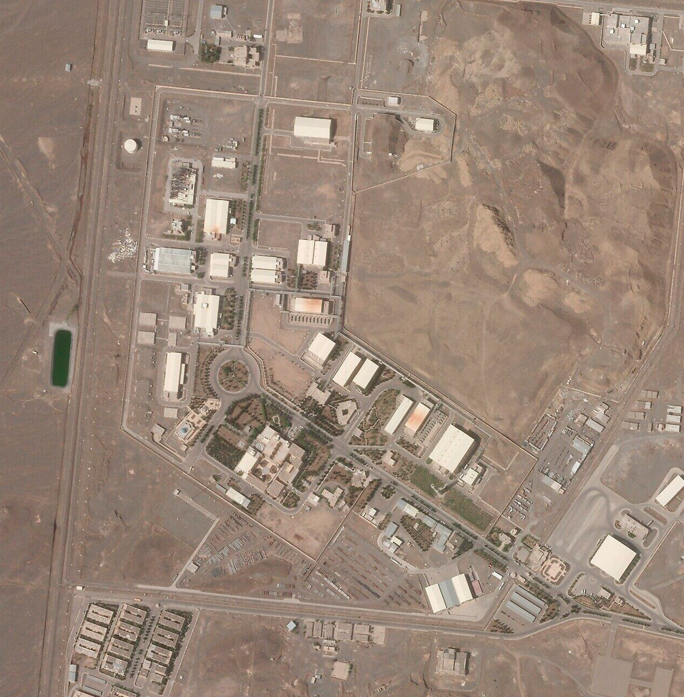
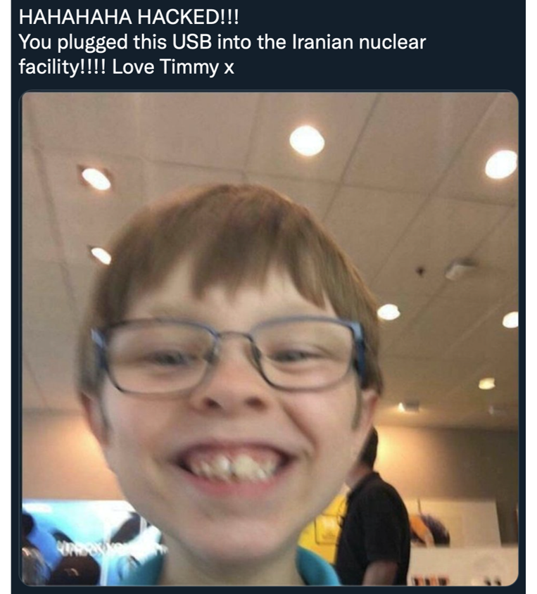

# Stuxnet

## Info About The Talk

These are the notes I wrote for a quick lightning talk on Stuxnet I delivered at the Abertay Ethical Hacking Society's weekly meeting back in late September 2021. The full slide deck in pdf form can be found [here](Stuxnet.pdf).

Bearing in mind that this talk was delivered at the very beginning of the academic year, I felt it was necessary to, in some cases, possibly over-explain myself. Hopefully if you yourself are a beginner you can get some help from this

## Intro

- Important to note for a variety of reasons that a significant amount of stuff in this talk (especially the less technical stuff) is very much unconfirmed, classified, does not officially exist, has not officially happened, etc etc etc. And whilst many experts believe what I’m about to say to be pretty much accurate, everything is alleged.

## Background

- This is the Natanz nuclear facility in Isfahan (ISS-fah-haan) province in central Iran
- A core part of Iran’s nuclear program
- It's where Uranium is enriched. 
- This process is crucial for both the development of:
  - nuclear energy facilities
  - nuclear weaponry. (IMPORTANT FOR THIS TALK)
- The US wasn't very happy with this because of a few different and extremely important and complex reasons. The main two are as follows: 
  - The Treaty on the Non-Proliferation of Nuclear Weapons, 
    - worldwide agreement not to develop or acquire new nuclear weapons
    - dismantle currently existing ones over an (undetermined) amount of time. 
    - the US, Israel, Iran (and the UK too) have all ratified this treaty
  - Israel is by far the United States’ biggest ally in the region, 
    - Iran and Israel have not historically had very good relations, 
    - possibility of war in the region is constant and if two opposing parties were nuclear-armed states, well… it wouldn’t be very good for anyone.
  - As a result the US and Israel (allegedly) felt a response was necessary, but they wanted to stop short of a conventional strike on the facility (for obvious reasons).. And so…

## What is Stuxnet?

- A computer worm, at its core
  - A worm being a piece of malware that self-replicates in order to spread across a network
- Designed to target a specific kind of Siemens SCADA programmable logic controllers used to control certain centrifuges, a core part of the Uranium enrichment process. 
- Made use of 4 separate zero-days (previously unknown vulnerabilities)
- Would output fake data to hide itself

### Operation Olympic Games

- In 2005 the George W Bush administration tasked the NSA with disrupting the uranium enrichment process at Natanz as non-violently as possible, this project was given the designation “Operation Olympic Games”

### Point Of Entry

- The facility in this case was what is known as “air-gapped”, 
  - the internal network at the facility was entirely disconnected from the wider internet, 
  - only way for a piece of malware to enter was via physical access (USB)
- A double agent was (allegedly) hired by the Israeli Mossad agency to enter the facility as a scientist and plug the USB containing the malware in
- The malware delivery vector (the USB) contained what appeared to be genuine digital certificates from Realtek, which is the 
  - kind of top secret thing that companies that size have in safes behind locked doors with guards, 
  - either Realtek were particularly stupid in defending their certs, or the group responsible stole the cert physically 
  - (heist movie, anyone?)

### Once It's In, Now What?

- At least three separate ways of getting itself to run:
  - Ways:
    - MS08-67 (used in Conficker attack), 
    - a Windows Shortcut (LNK file) flaw, 
    - a flaw in the print spooler service that allows arbitrary code execution (where have we seen that before lol)
  - These attempts are done in sequence (if one fails the next is tried)
  - the last two are both zero days
- Also two different ways of PrivEsc, both 0days (one is MS10-073)
- Realtek signatures were used to digitally sign a Rootkit and silently install it in order for the worm to have a comfy place to hide inside the system whilst retaining root privileges. 
  - The worm does this so well that even if an individual with root privileges were to look for the worm where they know it should be, they couldn’t find it, and the malware happily went around the internet for over a year without anyone realising it even existed.
- Two websites, mypremierfutbol.com and todaysfutbol.com were configured as command and control points, this allows the malware to be updated and for espionage to be conducted if the system is not adequately air-gapped

### This Is Where The Fun Begins

- The worm now has total control over the system it has infected
  - it could do whatever it wanted really, but it just goes to sleep instead
- When it decides the time is right, the worm wakes up and does a bunch of very odd but genius things:
  - begins to spin the centrifuges *just* outside safe parameters
  - has locked the centrifuges
  - plays back a short 21 second recording of the data gathered from when the centrifuges were operating normally.
  - ALSO increases the gas pressure inside the centrifuges, the gas inside is Uranium Hexafluoride and is prone to turning from a gas directly into a solid given the right atmospheric conditions, the gas pressure is increased to a point where this is not necessarily guaranteed, but it can (and eventually will) happen once or twice. 
- Now you have a locked centrifuge running slightly too fast with small rocks inside, and you have absolutely no idea.

## A Couple of Thought Experiments...

### Imagine You Were A Scientist At Natanz...

- Maybe you’ve been working there for a while and have a feel for when something is off, or when something isn’t acting as it should, maybe you can even hear the UF6 rattling around! But the computers are telling you everything's fine, you’d feel like you were going crazy.
- They start breaking in their hundreds, 
  - sometimes VIOLENTLY
- You can’t use this uranium for bloody anything
  - it’s nowhere near pure enough so your facility starts becoming obsolete in your bosses’ eyes
- What I would do is 
  - check everything every time something breaks,
  - I would replace every computer in the facility if I could, 
  - but the worm is already in, 
  - as soon as a new PC comes online it’s infected 
- Morale would be low, uranium production nonexistent, you’d start wondering why you even bother.

### Imagine You Were An NSA Agent (ALLEGEDLY) Making The Worm...

- The amount of work is insane
  - 4 0days 
  - several espionage missions including one into a Taiwan based corporation
  - development of a multi-functional worm that harms devices minimally
  - is totally undetectable on multiple fronts
  - plus undoubtedly a load of other stuff that we simply don’t know about because it’s classified. 

## What Happened Next?

- So, we know why Stuxnet exists, we know how it works, what was the end result? Other than a bunch of angry scientists, stressed spooks, and broken spinny boys

### Politically

- Iran strengthened their cyber capabilities
  - 5 APTs are linked to Iran currently
  - at least one formed after the attack
  - most likely others were given significant funding after the country promised to beef up its capabilities 
  - Iran has learned from this
- Nuclear Deal
  - Reached in 2015 between Iran and the UN security council:
  - Prevents Iran from building too many centrifuges 
  - heavily decreases the amount of uranium it can store (0 medium or highly enriched uranium)
  - and eased sanctions against the country, 
  - work on this began in 2013 and was fully implemented in 2016, however the US withdrew in 2017 because, uhhh… well… Trump lol

### Technically

- Loads of child malware
  - Duqu: Keystroke logger and data miner for industrial facilities
  - Flame: Recorded skype conversations, keystroke logger, screenshot gatherer, etc. Targeted middle eastern govt. facilities
  - Havex: Information gather from private energy, aviation, defence, pharma companies, mainly US, EU, and Canadian companies
  - Industroyer: Caused a power outage in Ukraine in 2016 (**NOTE**: This was written months before the war)
  - Triton: Targeted safety systems of a petrochemical plant in the middle east, which could have lead to serious injury or death for workers
  - Many more...

### Getting Out Of The Facility

- Unknown for sure, but the generally accepted series of events is that a worker brought a work laptop in, connected it to the internal network, it got infected, they took it home and connected to their home internet, and then it just spread, due to a bug in the code it was unable to detect that it was outside of Natanz
- Existence revealed in a pretty straightforward leak, someone leaked it to the press and we don’t know exactly who it was because crucial evidence that could have been provided at trial was not able to be released for national security reasons
- A 2011 video created to celebrate the retirement of Israeli Defence Force chief Gabi Ashkenazi listed Stuxnet as one of the successes under his watch

### Discovery And Disclosure

- Sergey Ulasen, a Belarusian security expert from a company called VirusBlokAda, heard that there were some arbitrary BSODs and reboots coming from some computers based in Iran, the virus had gotten out and started crashing devices due to a bug in its code, however he didn’t know this at the time
- Heavily recommend [this](https://eugene.kaspersky.com/2011/11/02/the-man-who-found-stuxnet-sergey-ulasen-in-the-spotlight/) article on the topic, really good read

## Thank you for reading

If you learned something from this, why not send me over a little tip by way of thanks? No pressure but it would be much appreciated :)

