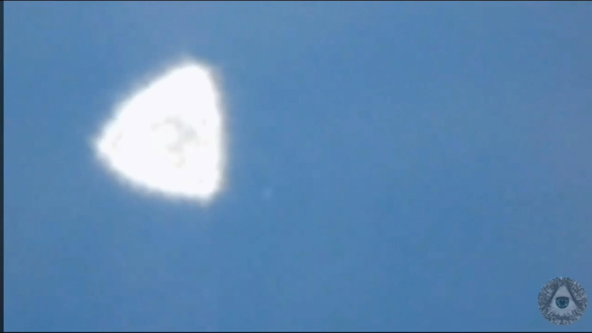

# UFOSINT: Open Source Intelligence and Unidentified Aerial Phenomena

*by Isaac Basque-Rice*

This talk was delivered at Securi-Tay 2023 on 2023-03-03 at Abertay University, Dundee, Scotland.

[Slides Available Here](UFOSINT.pdf)

## Introduction

So I was always a bit of a weird kid. Growing up I spent a lot of time with my nan watching loads of random documentaries, Unsolved Mysteries, that sort of thing. And the History Channel, being what it is, meant that it was only a matter of time before I got introduced to UFO conspiracies. I was also (and to a great extent still am) an anxious kid, so these conspiracies, to be frank, scared me shitless (in many ways this talk is borne out of my anxiety). Obviously, as I grew up I realised that Ancient Aliens didn't exist and are, as with a lot of conspiracies, a cope for people without common sense and with a deep desire for things to be more than what they initially seem. Occam's Razor tells us, though, that the simplest explanation is usually the correct one and an in-depth understanding of reality reduced my anxiety to a great extent, as it often does. But my fascination with UFOs always remained, albeit with a more sceptical lens fitted to it.

Unidentified Flying Objects, or as the US Military now prefers to call them, Unidentified Aerial Phenomena (UAPs, I'll be using the terms interchangeably), are exactly what they say on the tin, things in the air that you can't identify. So in the most basic terms, UFOs are indeed real. Often, though, we end up convincing ourselves that what we see in the sky is aliens, when in reality (even according to the [UFOs wiki](https://ufos.wiki/investigate/)!!!) 90% of the time these are easily explainable by natural or human phenomena.

In this talk, I'll be going over some examples of UAPs caught in images and on video, and I'll be aiming to provide some logical, rational explanations in each case using some very simple open-source intelligence techniques. In many cases, the explanation is just as interesting as the lack of an explanation, UFO research often strays into stuff like camera technology, atmospheric physics, satellite and aeroplane research, and human psychology. If we have time I may also go over one particularly compelling case for which there is no rational explanation at the moment.

At this point, there may be one question on your mind though...

## Who Cares?

Why does this matter? Surely UFOs are weird but ultimately harmless phenomena that we can all get a bit of entertainment out of? What's the point in doing the research to debunk them and ruin the fun? Well, as the US Military (and likely every other military in the world) knows all too well, if something is flying in their airspace without their permission and what it is cannot be determined, that could be a serious breach of national security. The last thing the US Government wants is a foreign drone in their backyard, right?

**NOTE**: I'll be talking a lot about UFOs in the context of the US and the US Government. This is for a few reasons. Firstly, as you can see by the map below, a *significant* portion of reported UFO sightings happen in the United States (as well as the UK of course).

Additionally, however, UFO phenomena both in media and real life are intrinsically linked to the US Military in particular. Try to think of one alien movie where the American state (or a stand-in for the Americans) is not either the primary protagonist or antagonist. It's probably pretty difficult, right? In real-life terms, though, the US is, surprisingly, the most open and upfront major nation in a lot of regards, you won't often hear Russia or China openly admitting to suffering a cyberattack, for example. And this extends to their UFO research too, the declassification of the videos at the end of the presentation, as well as documents relating to genuine, honest-to-god UFO, research the US Military have conducted. Essentially, it's the easiest and moth forthcoming place to do research on this kind of thing.

The US government has been taking the threat of UFOs *extremely* seriously for a long time. Project Blue Book, which was essentially a government registry of UFO sightings and whether they're a threat to national security, ran from 1952 to 1969, and you may have heard in recent months that they're preparing and submitting an annual UAP report to their congress, much of which remains classified. Heck, even the change of name from UFO to UAP was to dissuade people, especially Military Personnel, from stopping themselves from reporting unusual phenomena for fear of reputational damage, (as well as the fact it is a more accurate term, of course). 

The fact of the matter is that UAPs, whether alien (or even man-made) or not, pose a possible threat to everyone's security, all it takes is one misattribution or accident for something awful to happen. One particularly unfortunate case in Ecuador in the late 40s saw an adaptation of the famous Orson Welles radio broadcast of The War Of The Worlds, and when the local populace in Quito realised it was a hoax, some took it upon themselves to set the radio building alight, resulting in 7 deaths, the firefighters were away dealing with the reported UFO sightings.

The ability to identify UFOs as harmless phenomena is crucial to a safe and secure world. So with that said, how *do* we identify them?

## Investigate Your Own UFO For Fun (Probably No Profit Though)

To investigate a UFO all you really need in a lot of cases is the requisite knowledge of a variety of possible explanations. You'll probably find once you know enough of them that the majority of sightings, if not all that are found on tape, fit into one or more of these categories. These are six-fold and are as follows:

1. Artifacts: In-camera or around-camera effects that people can mistake for UFOs, these are relatively and increasingly common, although they shouldn't be, as looking at a UAP outside of the camera would quickly identify it as nothing special really. Examples are interior reflections, lens flare, bokeh, black dots, rolling shutter, dust and scratches, and blooming
2. Astronomic: Often people mistake natural astronomical effects as UFOs, comets, asteroids, planets (commonly Venus apparently), stars, and so-called "Transient Lunar Phenomena" which are often outgassing or comet impact on the moon.
3. Atmospheric: Often clouds, as anyone who has seen the movie Nope will tell you, clouds sometimes have a weirdness about them that most people aren't really able to explain. Clouds people often mistake for UFOs include Undulatus, Lenticular, Arcus, Iridescent, Mammatus, and Virga Holes. Other atmospheric phenomena that people may mistake for UFOs are generally electrical disturbances or ionic stuff I didn't pay enough attention to in Physics class to fully grasp, such as Sprites, Ball Lightning, Auroras, or my personal favourite, St. Elmo's Fire.
4. Man-made: Self-explanatory really, people make stuff that other people don't know about, and it can result in reported UAP sightings. Balloons, Aeroplanes, lasers, flares, drones, projections, and a source of much anger for me personally, Elon Musk's Starlink.
5. Nature: Birds, Insects, and Seed Dispersal can often result in UFO sightings, especially at night. One particular case that immediately jumps to mind is that time a flock of birds over the Korean DMZ resulted in a UFO report and an immediate scramble of South Korean fighter jets. Many insects also reflect light in a way that may be confusing, and when they're up close to the camera may seem further away.
6. Optical Effects: In many cases, a trick of the light means the one thing we can use to observe the world around us becomes untrustworthy, mirages that make distant objects look like they're floating, ice crystals reflecting the light of the sun in a weird way, things that look like faces, and loads of other phenomena can cause this kind of thing.

## Case Study 0: The Balloons™

So, Seen as how it's recently been a topic of much interest, most of you are probably aware of the Chinese Balloon Incident. On the off chance you aren't, here's a refresher: between January 28th and February 4th, 2023, a high-altitude balloon that was of Chinese origin was spotted and tracked over both US and Canadian airspace. See a map of the estimated route of the balloon:

This, obviously, is not an Unidentified Aerial Phenomenon, it has very much Been Identified, however, I think this can provide some excellent context to us, as weather balloons (and indeed balloons of other kinds) are an exceedingly common UAP amongst people on the ground and not in the know about this stuff, the Roswell incident was likely a weather balloon, for example. In particular, from the videos taken of the balloon as well as its estimated path, we can see that the wind affects it substantially, it's roughly round in shape (a common UFO shape is the sphere or the "tic-tac", which could indicate the object is filled with something like helium), and floats silently.

I just felt like I had to mention this because it is both funny and relevant to the topic of today's talk. For the record as of the time of writing the exact reason the balloon was there has not been determined, but I imagine neither Chinese nor US intelligence will be especially forthcoming given the politically... sensitive nature of the world we're in right now. [This](https://twitter.com/RnaudBertrand/status/1621753847390830592) is a good thread on the topic if you're interested.

Fun additional non-UFO related fact: this incident resulted in the first air-to-air "kill" ever performed by the F-22 fighter jet in US history,  as well as the following balloons. Really keeping 'em safe out there boys. :salute: 

There have also been other UFO incidents after this initial one. These objects, as far as anyone can tell, are not uncommon and, importantly, are *not* evidence of extraterrestrial interference. Logically speaking, if an alien civilization were advanced enough to have developed faster-than-light travel to visit earth, why the *hell* would they let their craft get shot down by, what is I'm sure to them, sticks and stones level weaponry?

The increased interest in these objects is for a mixture of political and technical purposes. After the initial balloon incident, "[NORAD] readjusted its filters to better spot slow-moving targets operating above a certain altitude", meaning the objects found are just the objects *caught* by the new approach, and are likely much more T than ET.

Mick West, Game-Developer-Turned-Debunker, often talks about the "LIZ", Low Information Zone, out of which UFOs are invariably borne, sentences like "limited information", "claimed to have seen", "differing reports", and "conflicting eyewitness accounts", combined with the prevalence of social media and the lovely pattern-seeking brain we all have up in our noggins results in people fearmongering over things that have rational, down-to-earth explanations. You will have seen the balloons and heard the stories, what you may not have seen is the announcement by the US Senate Majority leader Chuck Schumer that "intelligence officials believe that object, as well as the unknown object, shot down over Alaska on Friday and the craft, downed over South Carolina waters earlier this month were all balloons.", which is totally in line with the actual facts (following the Jetstream, no visible signs of propulsion, operating at approx 40,000 ft, etc.).

## Case Study 1: The Inverkeithing Sphere

[Original Post](https://www.reddit.com/r/UFOs/comments/10ijukd/the_inverkeithing_sphere_in_scotland_allegedly/)

So now that that's out of the way, let's start out with some low-hanging fruit... This image (see below) was taken somewhere along the coastline of Inverkeithing in southern Fife, about 55km southwest of where we are now as the crow flies.

The title of the post on the UFOs subreddit that this was taken from is "The Inverkeithing Sphere in Scotland. Allegedly not seen with the naked eye when the image was taken.". This second bit is remarkable as it implies that the sphere was either moving at a significant rate of speed or has some kind of cloaking capabilities that are defeated by digital photography. Ignoring the latter which gets into some conspiracy ideas quite quickly, if it were the former we could expect some motion blur or artefacting on the texture of the sphere caused by the rolling shutter.

Taking a look at the image itself, however, we can note a couple of things off the bat here. The sphere has a texture to it, which is abnormal relative to standard UFO imagery, usually spherical objects are remarked to be smooth, but no matter, this doesn't necessarily disprove anything yet. 

If we take a look at the wider image, however, things become a lot clearer a lot quicker. 

Firstly the shading of the image, specifically the sharp shadows seen in the grass at the bottom of the shot, they're quite similar to the shadows on the sphere itself. But when we look at other objects in the shot, and the keen-eyed amongst you may have noticed this already...

There's a dog right there...

**Conclusion**: It's probably a dog's ball in mid-throw, likely off to the left of the shot, as that's the direction the dog is running.

## Case Study 2: UFO above Sapphire, Las Vegas

[Original Post](https://www.reddit.com/r/UFOs/comments/zu0xxx/ufo_above_sapphire_las_vegas/)

As I'm sure a lot of you know, the Mojave Desert in Nevada is somewhat of a hotspot for UFO enthusiasts. Roswell, Area 51, the Black Mailbox, this is where it all goes down. If you knew this going to Vegas, for example, you could be very mentally primed to experience a sighting yourself, which can lead to some unfortunate circumstances if you aren't... in a state to view things from a sceptical lens.

Below you can see a screenshot from a TikTok video taken 2022-12-22, purporting to show lights in the sky above Las Vegas.

This is a classic case of man-made and natural phenomena coming together to create something unexplainable within the moment, but clear with the benefit of hindsight. If you were to look at satellite imagery immediately surrounding the Sapphire... "Gentleman's Club"... things become a bit more obvious.

**Conclusion**: The red lights in the video are three series of uplights placed on top of the Las Vegas Hilton hotel projecting onto the cloud layer, these two yellow light strips are the Wynn and the Encore hotels, and that weird small strip of light to the bottom right of the Hilton is... drum roll, please... Trump International!!

This particular phenomenon is not very common in Vegas, admittedly. It's likely caused by reflective ice crystals being formed in the cloud layer during the recent "arctic blast" the US experienced during that winter period. The reflectivity was incidentally probably increased by the relative warmth of the desert, as a larger number of smaller crystals are more reflective than a smaller number of large ones, meaning when this lighting phenomenon does occur it's probably more likely to occur in the desert areas (not a scientist, could be wrong).

## Case Study 3: Lights on the ISS Live Feed

[Original Post](https://www.reddit.com/r/UFOs/comments/oixo2s/can_someone_please_explain_what_i_just_saw_on_the/)

Now this one's a little more interesting. Below you can see a screenshot from the live feed of the International Space Station, taken approximately 2021-07-12. In the full video, the lights slowly move from left to right across the screen at a constant rate of speed without deviating from their path. You can also notice some other smaller points of light seemingly behind the main lights, which could reasonably be construed as stars in space.

Let's do some investigating then. We can see from this similar shot taken 2023-01-28 that this camera is pointed directly downwards at Earth. We know this is the same camera because this piece of the station in the top right looks the same as in the original imagery. The "stars" are likely dead pixels from a camera exposed to the elements of space for an extended period of time.

This doesn't discredit the UFO theory just yet though, could be objects flying between earth and the ISS, which is, of course, 417km above the earth. So what's the explanation here? 

**Conclusion**: Well long story short, they're probably fishing vessels. The original footage, whilst since removed, was allegedly taken somewhere above the south Atlantic ocean, and [fishing vessels normally do emit enough light to be seen from the ISS](https://earthobservatory.nasa.gov/images/84571/the-many-colors-of-electric-lights). In particular, they're probably squid fishing ships, which normally operate at night and use light sources to attract the squid.

## Case Study 4: Antuco, Chile

[Original Post](https://www.reddit.com/r/UFOs/comments/xsafch/a_triangle_shaped_orb_was_filmed_near_antuco/)

Here's another interesting case I investigated myself. Below you can see two screenshots of a "triangular orb" (lol) apparently floating in the middle of a valley near Antuco, Chile. This was taken from a video of three men hiking up the Antuco volcano 

The location is confirmed by a man speaking in the video, he says "Epic moment, epic moment guys! We are at volcano Antuco and looking down the valley look what we found! An OVNI (Objecto Volador No Identificado, UFO in Spanish), an object shining over there unidentified (the NI in OVNI)." So with that information, it became a simple case of using Google Earth to identify exactly where they were standing and what direction they were looking at, and after a while searching google earth, I found this:

As you can see here the mountain formations match almost perfectly with those seen in the video. The small hill between the valley and the mountain, the peaks of the mountains on the left, and the mountain on the right, also. At this stage, I can say with a high degree of confidence the light is emanating from within the valley, as the direction of the camera faces down in that rough direction.

In fact, and this may be wrong, I believe I've found the exact source of the light. The image you see below is a small "locality" named Peluca, you can see the name of the location in the Google Earth shot. That house you can see encircled in red has a sheet metal roof and is angled in such a way relative to both the volcano (where the arrow is pointing) and the cardinal directions (as shown by the compasses) that, if the sun were to shine on it at the right time of day, it would reflect quite a lot of light directly onto the mountain.

All of this doesn't explain the triangular shape though, does it? The explanation there is something called a "Bokeh" effect. This is something you will have seen before in photography, an example is below. This is caused by the shape of the camera aperture when attempting to take an out-of-focus shot of an object. The smallest number of blades you can have for an effective aperture is 3, hence the triangular shape.

**Conclusion**: The sun's light bouncing off a sheet metal roof caused a small point of light to reflect onto the mountain where this group was, and the triangular aperture of the camera caused a Bokeh, which appeared like a triangular UFO. 

## Case Study 5: Strange Lights Above SE Houston

[Original post](https://www.reddit.com/r/UFOs/comments/10dksw2/strange_lights_above_se_houston/)

Here's one that took a little bit less work but is also an extremely common occurrence, especially around the time of year that the video was created. Below you can see a set of 11 or so lights floating silently above the South East Houston, TX area.

This video was taken on January 16th. This is the run-up to Chinese New Year, there is a reasonably sizeable Chinese and Chinese-descent population in Houston, and one of the forms of celebration for that holiday is to light sky lanterns that float up similar to a hot air balloon. That is what you are seeing here. Note the slow movement that could be characterised by the wind.

**Conclusion**: Sky Lantern festival.

## Case Study 6: The USS Nimitz and USS Theodore Roosevelt Encounters

This is The Big One. I'm afraid we do have to divert a little bit off-course here because, up to now, all of the things I've spoken about have had reasonable, common explanations. These videos, however, do not.

### FLIR

In 2004 the US Navy carrier strike group led by the USS Nimitz spotted a number of targets moving off the coast of Southern California and Northern Mexico. A pair of fighter jets led by Commander David Fravor was quickly scrambled and headed toward the targets. The radar had identified these dots two weeks prior making erratic movements in the same location, they would appear at over 80,000ft above sea level and descend within a matter of seconds to approximately 50ft above the sea. Naturally, the new radar system being trialled on the Nimitz's missile cruiser, the USS Princeton, was taken offline and recalibrated at this time, but when it was brought back online the dots only became sharper. 

When Fravor and his counterpart, Alex Dietrich, approached one of the UAPs, they spotted a white, oval object hovering above an ocean disturbance. The object was approximately 40 feet long and was described as looking like a giant tic-tac, an observance corroborated by Dietrich. When they returned to the Nimitz, visibly shaken, they informed a further two, unnamed pilots who were about to go out of what they saw. One of these jets was equipped with an Advanced Targeting Forward-Looking Infrared (ATFLIR) camera, and the following footage was captured:

This footage is named FLIR and has been declassified by the Pentagon, who themselves have referred to it as an Unidentified Aerial Phenomenon. Pilots such as Fravor and Dietrich are amongst some of the most highly skilled aerial observers on earth, so whilst their testimony and footage are not *incontrovertible* (we'll get to that in a minute), it likely rules out some common aerial phenomena. At this time there is simply no rational explanation that is supported by all of the available evidence, and as such, this is a genuine Unidentified Flying Object.

**Conclusion**: Unknown.

### GIMBAL & GOFAST

The Pentagon also released two further videos from the time period 2014-15 taken off the eastern coast of the United States near Florida, taken by pilots associated with the USS Theodore Roosevelt carrier strike group. These are referred to as GIMBAL and GOFAST. Screenshots from the two videos can be seen below.

Let's tackle each of these one at a time, starting with GOFAST, as it is likely the easiest to explain. The video was also captured using an ATFLIR, as you may be able to tell this image was taken in infrared, and from the bottom left of the screen, you can see it is in "BLK" mode, which means the darker the item is, the more infrared energy, i.e. heat the object is giving off. This object is cold, which is unlike the other two videos in the series, and using other data available from the ATFLIR and some trigonometry, it is possible to determine this object's distance from sea level. 3.6 nautical miles to target, the camera is elevated -33 degrees, aircraft altitude is 25,010 ft, `3.6 * SIN(33) = 1.96` nautical miles from the aircraft. This means it is approximately 12,000ft from the aircraft and 13,000 feet above sea level.

The movement of the object is caused by the parallax effect, the aircraft, our point of reference, is moving fast and stably tracking the object, but the object below is not moving fast at all. the former game developer and prolific expert UFO debunker Mick West claims this is a sea bird, as sea birds can have exceptionally cold external feathers to preserve insulation. This seems like a rational explanation to me.

**Conclusion**: A sea bird or debris floating in the wind.

GIMBAL, however, is not *quite* clear-cut. In the video you see it rotating. This rotation can be accounted for by the in-camera artefacting resulting in a flare that, when the camera rotates (as it often does to keep a stable image) results in movement. This is also covered by West in a series of videos, but it does not account for what the object *actually is*. There are, of course, theories, that the object is the exhaust from another jet a significant distance away, but the afforementioned observer training may also discount that (although once again they were unable to determine what a bird was so who knows). 

**Conclusion:**: Unknown, possible jet fighter

## Conclusion

To conclude, the topic of UFOs and extraterrestrial life has been a subject of fascination and speculation for decades, and interest has recently been once again on the rise. The idea that there is more to the universe than what we can see has captured the imagination of millions of people.

With the advent of the Internet, though, we can, like never before, make use of all of the tools available to us, and a little bit of knowledge, to show these UFOs for what they almost always are, easily explainable terrestrial phenomena that can be equally as easily shown to be so. However, it is important to remember that just because there is no concrete proof of extraterrestrial life doesn't mean that the idea is not worth exploring. The lack of evidence could be due to the limitations of our technology, or it could be that we simply haven't discovered the answers yet.

Additionally, the study of UFO sightings and the search for extraterrestrial life can teach us a lot about the universe and our place in it. By exploring the possibilities and contemplating the unknown, we can expand our understanding of the world and deepen our appreciation for the mysteries that still remain. I encourage you all to dig into this topic a bit, not only to hone your own OSINT skills, but to gain the same appreciation for our world that I have doing this talk.

Thank you for listening.

## References

🌎 Nasa Live Stream  - Earth From Space :  Live Views from the ISS (2021). Available at: <https://www.youtube.com/watch?v=86YLFOog4GM/> (Accessed: 28 January 2023).

Boardman, A.A. (2020) An Illustrated History of UFOs. 27 Westgate Street, London E8 3RL: Nobrow.

BoredGeek1996 (2023) ‘The Inverkeithing Sphere in Scotland. Allegedly not seen with the naked eye when the image was taken.’, r/UFOs. Available at: <https://www.reddit.com/r/UFOs/comments/10ijukd/the_inverkeithing_sphere_in_scotland_allegedly/> (Accessed: 28 January 2023).

Cho, J. (2019) UFO over Korea’s DMZ was actually a flock of birds, ABC News. Available at: <https://abcnews.go.com/International/unidentified-flying-object-koreas-dmz-flock-birds/story?id=64061071/> (Accessed: 11 February 2023).

Cornish, A. (2021) ‘What The Pentagon’s UFO Report Reveals About Aliens — And Ourselves’. NPR (Consider This from NPR). Available at: <https://www.npr.org/2021/06/25/1010382914/what-the-pentagons-ufo-report-reveals-about-aliens-and-ourselves/> (Accessed: 20 January 2023).

Explained: ‘Go Fast’ UFO Video - Not Low and Not Fast - Like a Balloon! (2019). Available at: <https://www.youtube.com/watch?v=PLyEO0jNt6M/> (Accessed: 13 February 2023).

Extraordinary Until Proven Otherwise (2020). Available at: <https://www.youtube.com/watch?v=SpeSpA3e56A/> (Accessed: 11 February 2023).

fulminic (2021) ‘Since I believed horizon moved along with rotation of the Gimbal (so it only appears like rotating), I stabilized the horizon and proved myself wrong’, r/UFOs. Available at: https://www.reddit.com/r/UFOs/comments/nfahna/since_i_believed_horizon_moved_along_with/ (Accessed: 28 January 2023).

Gimbal UFO - A New Analysis [YouTube Video] (2022). (Navy UFO Videos - FLIR/GIMBAL/GOFAST Analyses). Available at: <https://www.youtube.com/watch?v=qsEjV8DdSbs/> (Accessed: 11 February 2023).

Google Earth (no date). Available at: <https://earth.google.com/web/@36.13044219,-115.16580832,629.9998034a,1928.41409257d,35y,101.53180981h,0t,0r/> (Accessed: 28 January 2023).

Let’s Talk UFOs (no date) UFOs Wiki. Available at: <https://ufos.wiki/investigate/> (Accessed: 23 January 2023).

Liebermann, O. and Atwood, K. (no date) Live updates: High-altitude object shot down near Lake Huron, close to Michigan, CNN. Available at: <https://www.cnn.com/politics/live-news/object-shot-down-lake-huron-21223/index.html/> (Accessed: 13 February 2023).

MrAnon2k17 (2022) ‘UFO above Sapphire Las Vegas’, r/UFOs. Available at: <https://www.reddit.com/r/UFOs/comments/zu0xxx/ufo_above_sapphire_las_vegas/> (Accessed: 28 January 2023).

Pecorin, A. (2023) All 3 objects over US, Canada were balloons, Schumer says: Congress must learn more, ABC News. Available at: <https://abcnews.go.com/Politics/3-objects-flying-us-canada-balloons-schumer-congress/story?id=97055660/> (Accessed: 13 February 2023).

Swaggysagesi6pths (2023) ‘Strange lights above SE Houston’, r/UFOs. Available at: <https://www.reddit.com/r/UFOs/comments/10dksw2/strange_lights_above_se_houston/> (Accessed: 8 February 2023).

The Many Colors of Electric Lights (2014). NASA Earth Observatory. Available at: <https://earthobservatory.nasa.gov/images/84571/the-many-colors-of-electric-lights/> (Accessed: 28 January 2023).

tyrannosnorlax (2021) ‘Can someone please explain what I just saw on the ISS YouTube live feed? (Video name and time included)’, r/UFOs. Available at: <https://www.reddit.com/r/UFOs/comments/oixo2s/can_someone_please_explain_what_i_just_saw_on_the/> (Accessed: 28 January 2023).

Ward, A., Dorsch, K. and Scholes, S. (2021) ‘UFOlogy (UNEXPLAINED AERIAL PHENOMENA) with Sarah Scoles and Kate Dorsch’. Available at: <https://www.alieward.com/ologies/ufology/> (Accessed: 20 January 2023).

West, M. (2021) ‘I study UFOs – and I don’t believe the alien hype. Here’s why’, The Guardian, 11 June. Available at: <https://www.theguardian.com/commentisfree/2021/jun/11/i-study-ufos-and-i-dont-believe-the-alien-hype-heres-why/> (Accessed: 25 January 2023).

West, M. (2023) ‘This is what we mean by the LIZ, the Low Information Zone in which UFOs invariable occur. It can take a lot of work to disambiguate objects in the LIZ, and sometimes shooting them down is the easy, albeit expensive, option, <https://t.co/gRJCyS6p3k’/>, Twitter. Available at: <https://twitter.com/MickWest/status/1624811390866427905/> (Accessed: 13 February 2023).

Why The US Military is Studying UFOs (2023). Available at: <https://www.youtube.com/watch?v=wQSxY7TR6mI/> (Accessed: 11 February 2023).
