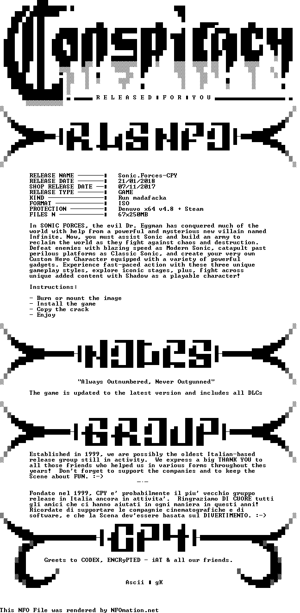
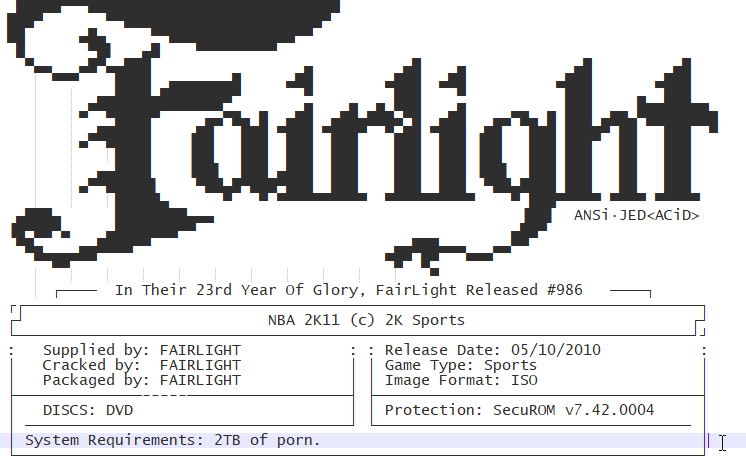
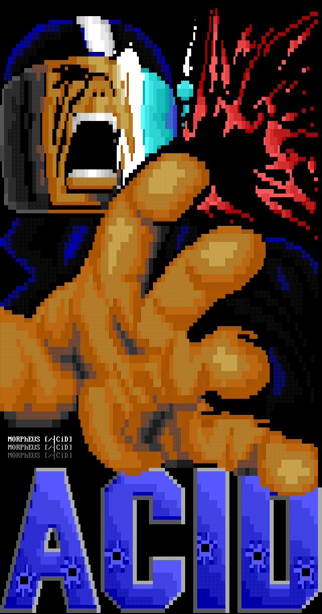
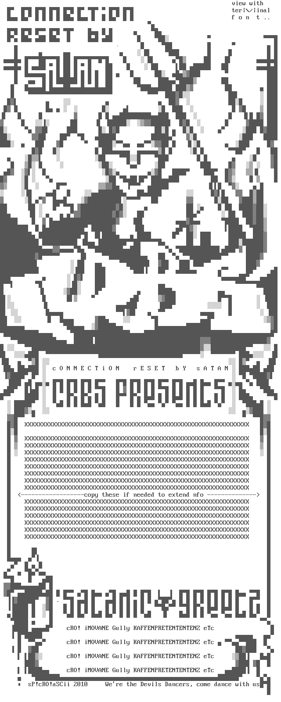
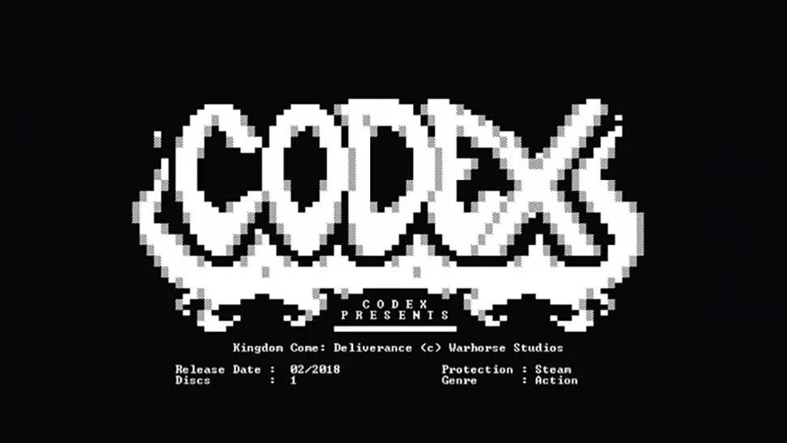

# Who What When Warez Why - Piracy From The Source

By Isaac Basque-Rice

Talk given 2022-03-09

## BIG FAT DISCLAIMER

For legal reasons I have to say at the very top that I do not condone anything I'll be talking about over the next 40-50 minutes of your time, Any illegal activities herein should not be considered an endorsement, and you absolutely should not attempt to replicate anything I mention without the express permission of someone who's allowing you to do this. You know, basic white hat shit.

I'm also not here to discuss the ethics of anything I'm about to talk about, this is a conversation I'd love to have at the pub but it's in my opinion too complex a topic to talk about right here right now. So with that...

## Where does pirated stuff come from?

Have you ever heard of or seen something that's been pirated, a piece of software, a video game, a movie or TV show, and thought "how on earth did that get there?". You're obviously pretty technical people so you've probably heard of things like DRM (Digital Rights Management) software, you may even have a vague notion of something being "cracked" so its usable in pirated form. But, like, how though? Who? Why?

The answer to this is... or was... the Warez Scene. (Note: I'll be using present tense for this presentation as it is still around somewhat, but its nowhere near what it used to be, also getting very conflicting reports during my research about how active the scene still is at the moment, I suppose there's good reason for that lol, someone's gotta be cracking games tho)

## The Scene

The Warez Scene is an underground, extremely secretive, highly organised, worldwide network of pirate groups whose sole purpose is to obtain copyrighted materials (Warez) and break copy protection on them in order to distribute them freely.

Lets start with a bit of an overview. 

The Scene has been around for essentially as long as the Internet has, the first scene groups popped up on Bulletin Board Systems in the 70s and 80s. A lot of info I found during my research on textfiles.com (excellent resource btw) was scene members complaining about how far the scene had fallen and how much better the good old days were... in 1995. So the old adage about any new tech being used for porn can probably also be used for piracy as well.

Because the Scene has been around for so long, naturally, these guys have gotten REALLY good at what they do. The speed at which their activities go from initial access to a piece of software to full release on peer to peer sites like the pirate bay is astonishing, a couple of days maximum for reversing (unless there's a new piece of DRM, but we'll get back to that), followed by release to internal groups for validation, and then p2p access within maybe a few hours. This will be much more impressive to you at the end, I guarantee it.

And don't get me wrong, this isn't some kind of dull distribution network, like someone sending the latest episode of a TV show to a group chat a day after release (not that I know anyone who'd do that). Scene rules guarantee quality releases almost 100% of the time. The concept of not trusting a download for fear of a bitcoin miner hidden in the crackfile is nonexistent in the Scene. The rules also mean its pretty difficult to catch them, an agreed upon set of security measures actioned by a self-selecting group of highly technical people is, it turns out, EXTREMELY good for security. 

So... Lets get into this shit shall we?

## The Hierarchy

The scene operates using a fairly strict hierarchy of users and systems. At the top are Release Groups, the people who do the cracking and who release the cracks to the next group down, the Topsites. Topsites are private FTP Servers that operate as a series of centralised areas for the sharing of pirated media, these things are very strictly scene members only and operate to a series of rules that we can go over in just a moment. After them there are Couriers/Racers who move files between sites (and occasionally to P2P sites), under them are P2P sites, and finally, at the very bottom, (likely) you and I... Dirty Leechers.

### Release groups

Release groups, also known as Warez groups, are groups of individuals who are responsible both for the cracking of DRM protected video games and software, and the unauthorised publication of films, music, tv shows, books, and so on. Scene release groups follow a strict set of rules to ensure quality, which can be found [here](https://scenerules.org/) (I really recommend going through some of these, not because you want to learn to crack because the files in here don't really concern that, more to gain a good understanding of how tightly controlled things are, and also learn a thing or two about media, DAISY audiobooks are a good example). If these rules aren't followed tightly, the release is subject to being "nuked" or removed from topsites. Release Groups are known for publishing statements and information in text files with the extension .NFO (info), many of these contain excellent ASCII/ANSI art, which we'll go over later in the talk. Interesting and well-known examples of Release groups are:

- 3DM
- CODEX
- CONSPIR4CY
- PARADOX
- SKIDROW
- Steam Underground
- STEAMPUNKS

### Topsites

Topsites are typically extremely secretive FTP servers with high storage capacity (typically in the tens of terabytes) and equally high transfer speeds (thousands of megabits per second, enough to transfer a blu ray in a few seconds) that store the cracked media for distribution amongst the scene groups and other explicitly authorised users. From what we've seen from topsites that have been taken down by the authorities, due to the high demand placed on these sites it's actually not terribly uncommon for them to be hosted in universities and other legitimate organisations, under the noses of administrators. 

Topsites often have two staff roles, Site Operators (SiteOps) who have root access to the server and associated IRC channel (an IRC Channel being an online standalone messaging server, kdina like DIscord but without voice channels, they've been around longer than mos of us here lol) and determine who is allowed in and who isn't, like a discord server owner essentially. And Group Administrators, Gadmins, who as the name suggests have admin rights of certain groups. Other users include Affiliates, who are normally members of scene groups, and Couriers, who we'll go over in a moment.

Due to the illegal nature of these sites, some pretty interesting measures have been taken by the Site Operators and the scene as a whole to preserve their security. Obviously these things aren't advertised broadly but they're also barely even mentioned by name, *even within the scene itself*. For example (Taken from Wikipedia lol) of there was a topsite named "Blackbox", it would be abbreviated to "BBX", and then to preserve security even further, scene members in the know in IRC chats would censor the abbreviation to something like B\*\*.

On a technical level, security is often preserved in topsites in multiple ways, IP host or range (in the case of users with dynamic IPs) allowlisting, naturally with SSL encryption (but that's pretty much standard across the whole internet obviously), and a network of Bounced Network Connections, which you can think of like proxies for IRC clients and FTP, which is used to hide the genuine IPs of topsites. This is used to such an extent that often no users bar SiteOps and Gadmins even know the genuine IP of the site. 

Topsites often make use of a "credit system" that credits people data they're allowed to download from each site, usually in a ratio of 1:3. So for example someone could upload a file of 1GB and get 3GB download limit credited to their user account automatically (if the upload isn't nuked), this ensures a community of users who actively contribute. Users who benefit from this most are...

### Couriers/Racers

Couriers are individuals or groups who's sole purpose is to take a release from a group and distribute it amongst various topsites. Couriering has more people within it than crackers, suppliers, and sites combined due to the relatively simple nature of the process.

Due to the high volume of couriers, when a courier gains access to a topsite they're often expected to pass a "trial" so to speak, upload X amount of files within a typically short amount of time. Once access is granted couriers compete, or race, against one another to upload fresh media to topsites, these groups and individuals are then subsequently rewarded with credit for topsite downloads.

### P2P and Leechers

This is likely the stage that you are most familiar with, at some point after files are spread around the topsites, some couriers sometimes (read: almost always) decide to upload the cracks/miscellaneous files to peer to peer filesharing services, well known examples include The Pirate Bay, Kickass Torrents, and RARBG. These services (as I'm sure you know) aren't actually centralised servers that you can simply grab files from, like topsites (or most other websites that allow you to download content) are, they're more like an index of magnet links. On a high level, these sites allow you to access the files you want through a magnet link which opens a torrent client and downloads the file from a network of other connected users which already have the files themselves, known as "seeders", this is in contrast to "leechers", who gain access to the torrent but do not allow others to use the files they downloaded later on for their own torrent (v rude, but also understandable if you have data caps or don't want to get served with a copyright notice lol).

So what actually is a magnet link? Well... lets take this (taken from a Quora answer) as an example:

`magnet:?xt=urn:btih:dc2e7bf4a273dc4b25ae96e833fd50be2b00e953&dn=The+Humble+Indie+Bundle+6+for+Windows+%2B+Soundtracks&tr=udp%3A%2F%2Ftracker.openbittorrent.com%3A80`

This link is comprised of four parts
- `magnet`: a URI Schema, tells the browser it is a magnet link and invokes a torrent client to deal with it, this scheme allows resources to be referred to without the need of a single continuously available host (like HTTP requires), and can be generated by anyone with the file without the need for a central authority to issue the link
- `xt=urn:btih:dc2e7bf4a273dc4b25ae96e833fd50be2b00e953`: says that this is a bittorrent infohash (`btih`) magnet link and provides the hash itself, ensures the validity of the file requested, like most hashes do
- `dn=The+Humble+Indie+Bundle+6+for+Windows+%2B+Soundtracks`: the URL encoded name of the download, which allows for the client to display the name of the file without having any information downloaded from peers
- `tr=udp%3A%2F%2Ftracker.openbittorrent.com%3A80`: the URL encoded tracker, which allows for the torrent client to find peers participating in the torrent.

It is important to note that magnet links and peer to peer generally *do* have a legitimate use, in systems where it is both important for a user to gain access to a decently large amount of data, and for the central server who issues that data to have lower usage levels. A common place you'll find legitimate torrent/magnet links is downloading Linux distribution .iso files, due to both their size and the (occasionally) relatively small and underfunded network that facilitates the download.

## The Methodology

This is the part of the talk where I go into a little technical detail about *how* pirates actually crack programs with DRM attached. Another quick disclaimer: I have never done this myself and I am by no mean an expert in this area, low level exploits and malware reversing is an area of interest for me (it's the topic of my miniproject), but I will only really be able to provide a high-level overview here, if you're interested in more low level explanations though I can point you in the direction of a few neat resources.

So, first off, how does DRM work?

DRM is, at its core, really just encryption. if a piece of software uses DRM that software is fully encrypted with often patented encryption and decryption algorithms (as used in Apple's Fairplay, Google's Widevine, and Microsoft's PlayReady). When a user attempts to launch DRM protected software they aren't really launching the software, what actually happens is that a decryption key is requested from a license server which, on success, decrypts the software and then runs the actual program requested. 

Cracking some software that uses DRM is as "simple" (not really lol) as doing the following:

1. Installing a genuine and licensed version of the program
2. Running the program, allowing it to decrypt itself in memory
3. Using a debugger/disassembler (like Ghidra, IDA, or OllyDbg for all you Hacking 3 enjoyers out there) to locate where in memory this action is performed and save the unencrypted data to a file
4. Make that file executable and remove software "tendrils" that are still attached from the DRM.

Step 3 in this process is the most technically complex, requiring some knowledge of assembly language mnemonics and specific DLL files, however step 4 is arguably more complex due to the scene rules being as restrictive as they are, which we can cover in just a moment.

Within the debugger it's important to search for specific DLLs, Dynamic-Link Libraries, which are shared library files used by executables to run sections of code reused by multiple programs *during runtime* (as opposed to `.lib` files which are ran at compilation). in the case of a piece of software with a key activation input field one important DLL to search for is `GETDLGITEMTEXT`, which is a function in `winuser.h` that "Retrieves the title or text associated with a control in a dialogue box." Essentially, this is called when a user attempts to enter a software key, but if a breakpoint is placed on the section of assembly where this is called it is possible to step through the program to the point where something like `TEST EAX,EAX` is. This call is checking whether the value of the `EAX` register is null, therefore if a pirate were to change this to a non-null value (1, for example) it could theoretically be possible to gain access to the software. **NOTE: THIS DOES NOT WORK WITH EVERY PIECE OF SOFTWARE**

Another, simpler way is to purposefully remove or otherwise not obtain the serial key that decrypts the software, when said software is run, a message such as `Invalid key, please try again` may appear, which a cracker can use as a reference point, locate that string in memory, and step through the program once more to find out what condition needs to be met for the message to not appear, which may be either a hardcoded serial key (bad practise, not common), or an algorithm that generates keys for use later on. In the case of the latter, a serial key can be generated using the algorithm with a "keygen" program and boom, you have a crack.

A more advanced measure many game developers in particular are taking is known as Denuvo. This software is essentially DRM for DRM, in that it works to obfuscate already present DRM, meaning there is an extra layer of deobfuscation required to crack games with Denuvo present on it. This has resulted in some of the best crackers in the world (groups such as SKIDROW and CONSPIRACY) taking many months to crack Denuvo protected games. Denuvo itself is in constant dedicated development, meaning that when crackers find a workaround in the software it can actually be patched, as opposed to many forms of DRM which are just sort of left to be (with sporadic updates, of course) due to the fact the teams working on them are often not exactly large and/or permanently working on DRM. Denuvo's staff is also (allegedly) filled with former scene members and as such are aware of the workarounds and issues present in other current and former DRM schemes.

## The Releases

A "release" is simply a piece of cracked software that has been released onto a topsite, Release groups must follow a specific procedure which includes first ensuring the scene rules are followed with regards to encoding (see next section for more detail on the rules), after this they upload the release to a topsite, then issue a command to the topsite's IRC channel which announces the release. THis initial release is known as a "pre", all other releases after this pre are nuked as duplicates, "dupes", however if there is a technical error or the file breaks the rules the pre is nuked, wherein other groups swoop in and attempt to publish a "PROPER" or "REPACK" release. 

From Wikipedia: 

> Each release in The Scene consists of a folder containing the material (sometimes split into RAR pieces), plus an NFO and SFV file. The NFO is a text file which has essential information about the files encoded, including a reason for the nuke if the file is a PROPER or REPACK release. A robust NFO file may contain a group's mission statement, recruitment requirements, greetings, and contact info; many groups have a standard ASCII art template for the file, with the most prolific exhibiting elaborate artistic examples. The SFV file uses checksums to ensure that the files of a release are working properly and have not been damaged or tampered with. This is typically done with the aid of an external executable like QuickSFV or SFV Checker. Failure to include an NFO or SFV file in the release will generally result in a nuke, as these are essential components of the warez standard to which The Scene adheres.

## The Rules

As mentioned previously there is a pretty extensive ruleset for what is an is not allowed in the warez scene. These rules, naturally, change depending on the nature of the media that is being cracked. What follows is a showcase of some of the rules for a selection of well known forms of media. Naturally I couldn't fit everything in there so if you'd like to know about the rules for Nintendo DSes, WiiUs, and TV shows, please visit https://scenerules.org.

The rules herein are generally separated into multiple categories which can change depending on the type of media being cracked, often the name and packaging info for the crack will be included, as well as restrictions on file sizes and so on. There is also a distinction between "recommended" implementations and "must haves", whereby if you do not include the former you open yourself up to being "propered", edited, but nobody is compelled to do so, however for "musts" "there is no compromise, you either follow the rule or you get nuked.". The "." character is most often used as a delimiter to prevent whitespace in filenames.

Here I'll be going first into the basic rules for almost all releases and then following that with a small selection of special cases where the rules differ and/or where there is extra information I found interesting, maybe you will too (hopefully), if not, its my talk, oh well!

The scenerules.org site has currently active rulesets for the following formats:

- 0DAY
- AUDiOBOOK
- BDr 
- BLURAY 
- CONSOLE 
- COVERS 
- DVDR 
- eBOOK 
- FLAC v3 
- FLAC (WEB)
- GAMEiSO 
- MAC-OSX 
- MDVDR4 
- MP3 
- MViD 
- NDS 
- NSW 
- PDA 
- PRESSBOOKS 
- PS4 v1.17 
- PS5 
- PSV 
- S.I.R 
- SCRiPTS3 
- TV-720p 
- TV-720p (unf) 
- TV-SD 
- TV-SD (unf) 
- WEB 
- WEB (unf) 
- WiiU 
- WiiU 1.59 
- WMV-HD 
- X264, X265 
- SD-X2647 
- SD-XXX 
- XXX-iMAGESETS 
- XXX-iMAGESETS1 
- XXX-PAYSiTES 

### 0days

Going alphabetically and starting with something you may be surprised to see. In our line of work 0days are usually novel vulnerabilities in software, this is technically correct in this sense too but is used more specifically in the scene. 0days here are simply *all* new releases of *any* piece of software, as a result all cracks have to follow this standard unless otherwise specified.

These rules were published in 2010 so as a result they may be out of date.

1. Release name: \[Developer.name.\]Program.name.vVersion\[.Language\]\[.OS\]\[.CPU\]\[.Release.Type\]\[.Additional.Tags\]-Groupname
   1. developer name only required if the chance for "duping" is high (if name is not unique enough)
   2. Program name *must* be the official name of the application, no editorialising
   3. Language tags are only to be used in non-english releases, multilingual releases are optional but all supported languages must be included in the .NFO
   4. Windows versions must be in the format WinX (Win10, Win7, WinXP, etc.), Linux distros must be .Distribution.Linux, and so on, recommended to omit when version is WinAll, WinAll and UnixAll can only be used when it works under ALL versions of the respective OS (All Windows versions and All Unix versions like BSD, MacOSX, Linux, etc.)
   5. Recommended to omit CPU tag when architecture is x86
   6. Release types can be omitted if cracked, otherwise must be included (like in the case of a keygen)
   7. Separator can be _ or . but not mixed unless _ is present in the name of the file, for example
2. Packaging: 
   1. Filenames must be named to the previous standard + extension
   2. Any compression method that supports multiple files and long file names
   3. zip shall be maintained as preferred, with .diz (description plaintext file) inside
   4. unreasonable decompression times are disallowed, up to the discretion of the nuker what "unreasonable" means
3. Release Size
   1. allowed split volume sizes are: 1.44mb, 2.88mb, 5mb, 10mb, 50mb
   2. Maximum size is 70x5mb or 35x10mb, equal to 350mb, other sizes are allowed as long as the size doesn't go over 99 disks, oversized releases allowed when no valid iso exists or groups do not have an iso
   3. Size is valid when a group manages to reduce the size of the release by at least 30% without sacrificing documentation and common operating system components
4. Specific Release Type
   1. Must provide functionality **identical** to a fully licensed copy
   2. Additional requirements depending on the type of release (cracked must register the program automatically, regged must allow the program to register with required info in a readme or nfo, and keygens must run natively on a target OS)
5. Operating Systems
   1. If a developer has not specified minimum requirements the minimum Os must be Windows XP, so it can run on all NT platforms
6. Minor Updates
   1. Minor updates, or "MU", are updates to a program released within PRECISELY one calendar month of the initial release
   2. Major updates are allowed with ample reason in the .fno file, and are not limited to the MU period
   3. months are counted using CEST, as opposed to GMT/UTC
7. General rules
   1. Any release older than 1 year is not allowed to be "pre'd" without a READ.NFO or INTERNAL tag
   2. Group must release newest version of software
   3. nfo must provide minimum useful information pertaining to the software
   4. Don't release anything you don't want shared, as soon as a release is distributed it is considered public
   5. Stealing keygens is not allowed, make your own!!
   6. Security is #1 priority, information about anyone they don't want out there may have "severe repercussions" 

### C. 2008 consoles

Due to the nature of the console scene at the time these consoles are remarkably similar in their rules. This list comprises the three main consoles available in 2008 when this ruleset came out, i.e. PS2, Xbox360, and Wii.

1. Releases must be packed in RAR. SFV and NFO must be included.
   1. Rar because of compression rate
   2. SFV is like a checksum
2. Rars should be split to volumes of 50 MB(DVD5) 100 MB (DVD9) and for PS2 - 15 MB (PS2CD)
   1. PS2CD was playstation's proprietary format for games, early form of DRM
3. Rars must be compressed with M1 (fastest) or better.
   1. m1 is a flag in WinRAR that allows for fast compression, m2-5 are slower but compress more
4. The image of the game must be in .iso format for XBOX, .iso + .dvd for Xbox360, and a full dump for Wii
   1. `.iso` is a virtual disk file format, `.dvd` is for DVDs and isn't required on PS2, and wii requires a full dump because it requires full cryptographic keys stored in NAND memory to work well in emulators such as Dolphin
5. If a game does not include the english language, this must be specified in the dir name
6. If a game is rereleased for having additional foreign languages, the dir must be tagged MULTI and the nfo must specify which additional languages are included
7. No p2p dupes without proof of your own source.
8. Source of game disc origin must be included in nfo for xbox360 and ps2
9. A release must be pre'd no later then 30 days after retail date.

Console specific rules are as follows:

For Xbox360:

1. The security sectors must be patched
   1. A security sector is a small piece of data located on Xbox360 HDDs which identifies them as official Xbox360 accessories, essentially forcing you to use officially licensed Microsoft HDDs for upgrading, patching these allow Xbox games to work in emulator and for games to run on the console itself
2. If a game is not region free, the game region must be in the dirname.
   1. In the PS2 games are region locked but getting around this is trivial in comparison
3. PAL/NTSC dupes are only allowed when the initial game was not region free or when there are additional foreign languages.
4. If a game is rereleased for having additional foreign languages, the dir must be tagged MULTI and the nfo must specify which additional languages are included.

for Wii

1. Source of game disc origin must be included in dir name (PAL/NTSC/JAP).
   1. Getting around region locking on the Wii is also trivial if users have access to the hardware, however in emulator it is not
2. No tools like wiiscrub allowed.
   1. Can't find good rationale for this, could either be because wiiscrub can overwrite data from an existing save and possibly corrupt a game, or could also just be because it's too easy and they want the challenge lol

### Audiobooks

Something of note here, the author of the ruleset for Audiobooks makes the distinction between DAISY and Non-DAISY versions of audiobooks, this wasn't something I was aware of before but DAISY (Digital Accessible Information System) audiobooks are for those with visual impairments and other disabilities that prevent them from reading books, whereas non-DAISY audiobooks are more traditional, you know, your Audible books etc. Due to their separate standard, DAISY audiobooks have additional rules a cracker must follow. Sure they may be pirates but they would never break the Disability Discrimination Act!!! (Accessibility does actually seem to be very important for these guys)

The normal MP3 releasing rules apply here except for the following:

1. General
   1. Always populate both ID3v1 and ID3v2, this is important for proper playback
      1. These are standards for storing metadata on an MP3
   2. Always include author and title in the tracknames to avoid dupes, the title may be an abbreviation
   3. All releases must follow a similar format to the following: Author.Title.PublicationYear.Format.Language.ReleaseYear.Group (with - and _ as other acceptable delimiters)
   4. If publication year of the recording and if the publication date of the book doesn't differ the publication year should be excluded
2. Audiobooks
   1. The format type is always AUDIOBOOK
   2. Must be encoded using VBR
      1. Variable Bitrate, VBR files can vary the amount of output data per second, allows for higher storage rate (when less sound is playing less data is stored)
3. DAISY books
   1. The format type is always DAISY-AUDIOBOOK
   2. Original encoding must remain untouched (no reencoding allowed).
   3. Must include working SMIL (Synchronized Multimedia Integration Language, W3 standard for multimedia presentations. It defines markup for timing, layout, animations, visual transitions, and media embedding, among other things) files in an archive which can be done in one of the following ways:
      1. Include batch files for tracknames, must be able to rename daisy->release and release->daisy.
      2. Patch the SMIL files to work with the release names.

### Ebooks

1. Scans
   1. Minimum resolution is 96dpi but yet readable
   2. Crop pages if necessary
   3. No damaged/dirty pages
   4. The entire magazine/book has to be scanned (advertisings are optional, you can cut them off if you want)
   5. Removed commercials must be replaced with white/black page to maintain pages order
   6. Resize scans to max 1600x*
   7. Photographs in proper quality are allowed as scans
   8. Must be in .PDF
2. Retail
   1. Retail PDFs are not allowed to be modified (must be released as original)
   2. Merged PDF pages are allowed as retail
3. Hybrid
   1. Hybrids must be PDFs from virtual printers, screen captured readers or extracted PDFS from DRM-protected third party proprietary formats
4. DRM/Watermark
   1. DRM/Watermark protected documents are not allowed and must be removed
   2. No group watermarking allowed
5. NFO and DIZ
   1. Width of the nfo-file must be max 80 characters
   2. Release names must not be truncated or split
   3. Number of disks must be mentioned in diz-file
      1.  Example: DISK: [xx/??]
   4. Width of the diz-file must be max 44 characters
   5. Height of the diz-file must be max 30 lines
6. Other
   1. Allowed file formats: PDF, EPUB, Kindle (.azw, .kf8) and MOBIPOCKET (.prc, .mobi)
   2. No free from web allowed
   3. Conversions is not allowed (e.g. epub converted to pdf is not allowed)

### Nintendo Switch

The switch is an interesting and relatively unique case (within the scope of this talk at least) because instead of having a disk which is trivially interfaceable with any computer with a disk drive, switch games are stored on cartridges and, as with Nintendo, an absolute metric fuckton of proprietary formats and, yes, DRM. Hackers spent quite some time getting the ROM dumps to work.

Another note: The Nintendo hacking scene generally is some of the most interesting shit going, people have managed to find a bug in the boot ROM that allows you to execute arbitrary code, people turn their shit into fully functional Linux machines. And with Nintendo being in the news recently for shutting down WiiU and DS online support, the scene here is as exciting and popular as ever.

1. Packaging
   1. Release sizes increased from previous console generations, between 50 and 500MB
   2. otherwise unchanged
2. Image format
   1. Cartridge releases must be in .XCI format
      1. An XCI (NX Card Image) file contains the contents of a Nintendo Switch game card in the NX Card Image format. It stores an encrypted backup of a Nintendo Switch game, which includes the Switch game ROM, icons, and metadata. XCI files may also be used to contain updates to a Switch game.
   2. eShop releases must be in .NSP format
      1. An NSP (Nintendo Submission Package) file is a game package used by the Nintendo Switch console and Switch emulators, such as Yuzu or Ryujinx. It stores multiple files, which may include the game ROM, .JPG game icon, game updates, and game metadata. NSP files are typically used for storing backup dumps of Switch games and are similar to .XCI files.
   3. Full dump of new cartridge revision not allowed
   4. eShop releases must have all .NCA files with NAX-layer decrypted
      1. NCA (Nintendo Content Archive) files are a Nintendo Content Archive, which contains game data dumped from a Nintendo Switch game card. It stores multiple files that contain Nintendo content, such as firmware or a Switch game ROM encrypted with AES-XTS encryption. NCA files are similar to CIA files, which are used to store Nintendo 3DS content and WAD files, which are used to store Nintendo Wii content.
3. Proof
   1. Picture of cartridge with group tag included in jpg format
   2. Releases without proof will be nuked and any new pres without proof four hours after a nuke will also not be accepted
   3. You may censor private information
   4. eShop releases are exempt from proof
4. Updating/Patch/Trainer/DLC/eShop releases
   1. Significant amounts of detail herein, I encourage you to read this if you're interested

The majority of what remains here is pretty standard scene stuff.

### Misc

Most of the rules for other, more trivially crackable forms of media such as video, audio, ebook, and even NSFW content are, whilst extensive, also relatively simple. The vast majority of these files contain information pertaining to file naming conventions etc.

## The Art

Okay... Breathe... We're coming to the end of the talk now, so I thought I'd leave you all with one of my absolute favourite aspects of the scene... the ASCII and ANSI art scene members release with their .nfo files, it really is cool as fuck, absolutely gorgeous, 10/10 content, and really lends a distinct aesthetic to the entire scene. It *could* be argued (by people more knowledgable about art and its relationship to culture than me) that due to how early on the warez scene popped into existence that this is where the entire hacking aesthetic came from.

So often .nfo files are created in software like PabloDraw (example below), which is a text editor that uses special ANSI characters to colour and shade specific areas of a text files for nice effects. A specific draw of PabloDraw as that it was the first ANSI/ASCII editor to allow for multi-user simultaneous editing, naturally a good thing for warez groups (through integration with pre-existing IRC channels). If you are of an artistic persuasion I really recommend giving it a go!!!

Anyway, onto the actual art

## The End

If you have any questions or just want to chat, my twitter is probably the best place to reach out to me, [@IBRice101](https://twitter.com/IBRice101), otherwise, catch me at the pub!
